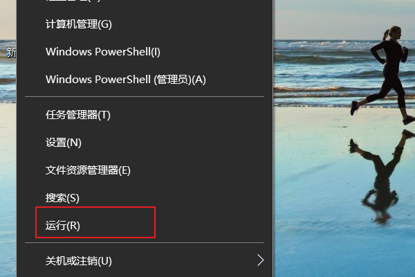
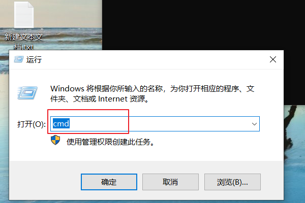
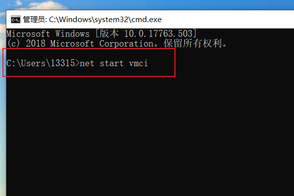
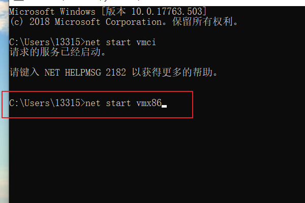
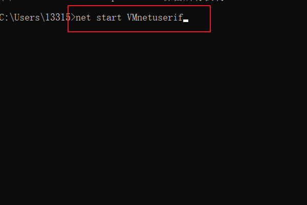
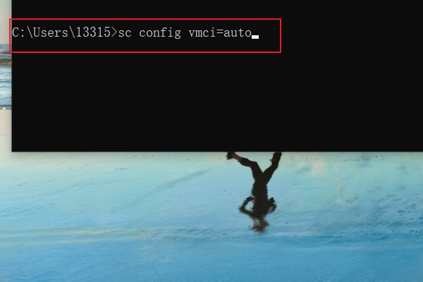
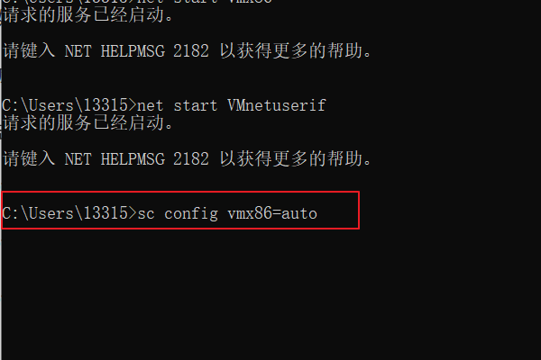
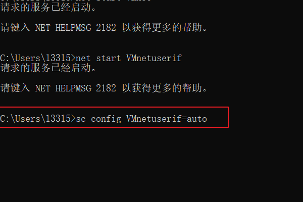

#  简解：

 你好

是虚拟机 服务 没有开启

点击“开始→运行”，在运行框中输入 CMD 回车打开命令提示符，然后依次执行以下命令。

net start vmci

net start vmx86

net start VMnetuserif

sc config vmci=auto

sc config vmx86=auto

sc config VMnetuserif=auto

我和你同样的问题，已解决  

# 图解：

这是因为没有开启虚拟机服务，只要将其开启即可解决。

工具：电脑。

1、用鼠标指向电脑桌面上的开始菜单，点击鼠标右键选择菜单上的运行。

2、再输入CMD，然后点击界面下方的确定。

3、输入net start vmci后，点击回车。

4、输入net start vmx86后，点击回车。

5、输入net start VMnetuserif，点击回车。

6、输入net start vmci后，点击回车。

7、输入sc config vmx86=auto后，点击回车。

8、输入sc config VMnetuserif=auto后，点击回车。

