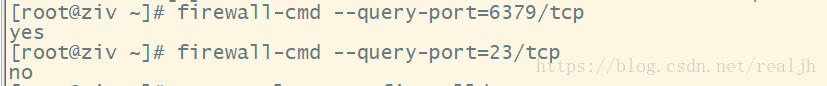
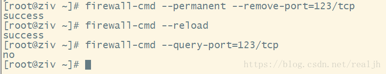
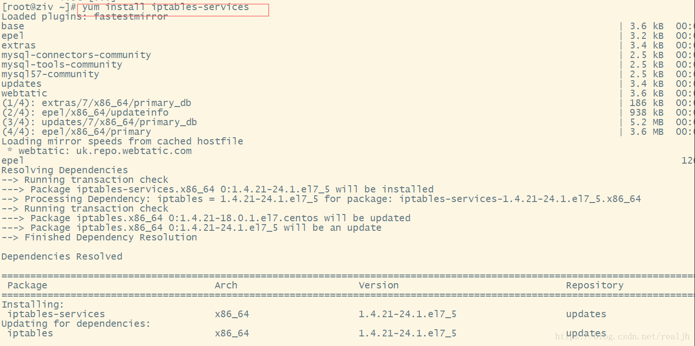
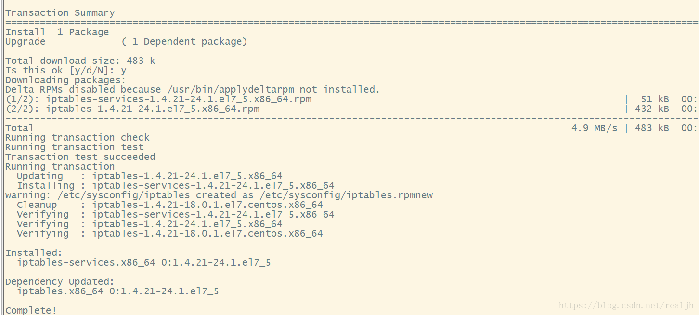

# Linux下Centos7对外开放端口

### 概要

最近在docker下搭建MySQL和Redis环境，远程linux主机内部网络都走通了，但是就是外网
无法连接远程服务器的MySQL和Redis。经过一番查找和学习，终于找到了问题，不仅远程服
务器上docker要做好内部和外部端口的映射，关键还要对对外开放的端口添加到防火墙中。

内容介绍的逻辑是：本篇文章先记录Centos7下查看防火墙状态和网络状态命令；下一篇将介绍通过docker大家MySQL和Redis环境并接通外网可以访问。

命令集合：

#### 查看对外开放的端口状态：

> 查询以开放的端口

```
netstat -anp
```

> 查询指定端口是否已开

```
firewall-cmd --query-port=666/tcp
```

> 提示：yes表示开启  no表示未开启


#### 查看防火墙状态：

> 查看防火墙状态

```
systemctl status firewalld
```

>开启防火墙

```
systemctl start firewalld  
```

>关闭防火墙

```
systemctl stop firewalld
```

> 开启防火墙 

```
service firewalld start 
```

>若遇到无法开启
>先用：systemctl unmask firewalld.service 
>然后：systemctl start firewalld.service


#### 对外开放端口：

> 查看想开的端口是否已开：

```
firewall-cmd --query-port=6379/tcp
```



#### 添加指定需要开放的端口：

```
firewall-cmd --add-port=123/tcp --permanent
```

> 重载入添加的端口：

```
firewall-cmd --reload
```

> 查询指定端口是否开启成功：

```
firewall-cmd --query-port=123/tcp
```


#### 移除指定端口：

```
firewall-cmd --permanent --remove-port=123/tcp
```



#### 安装iptables-services ：

```
yum install iptables-services 
```

> 进入下面目录进行修改：

```
/etc/sysconfig/iptables
```



