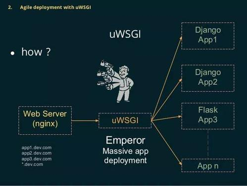

# 从django\flask\tornado的部署说起

## 1.概述

在python的web开发框架中，目前使用量最高的几个框架是django、flask和tornado，经常在开发的时候有人会拿这几个框架进行对比。

- django大而全
- flask小而精
- tornado性能高

tornado性能比django和flask高很多是因为tornado在底层io处理机制上和django以及flask有着根本的区别：

1. tornado\gevent\asyncio\aiohttp：底层使用的是事件循环+协程
2. django和flask：传统的模型、阻塞io模型

虽然django和flask比tornado和asyncio性能低，但是他们作为老牌的框架：生态丰富，代码容易理解，简单！但是我相信通过asyncio和tornado进行并发编程必定会成为未来另一个主流方向。这是我这个更好基于asyncio的框架。nodejs和go语言都得益于协程轻松实现了高并发。

## 2.django和flaks

在django和flask部署中，我们经常会遇到以下几个概念：

>web框架、wsgi、uwsgi、uWSGI、nginx、

这些概念是什么意思？

1. WSGI：全称web server Gateway Interface , WSGI不是服务器，Python模块，框架，API或者任何软件，只是一种规范，描述 web server 如何与web application通信的规范。要实现WSGI协议，必须同时实现web server 和web application ,当前运行 WSGI协议之上的web框架有Bootle , flask ,Django。
2. uwsgi：与WSGI一样是一种通信协议，是uWSGI服务器的独占协议，用于定义传输信息的类型（type of information）

3. uWSGI：是一个web服务器，实现了WSGI协议，uwsgi协议，http协议等。
4. WSGI协议主要包括server和application两部分
5. WSGI server负责从客户端接收请求，将request转发给application，将application返回response返回给客户端；
6. WSGI application接收有server转发request，处理请求，并发处理结果返回给server。application中可以包括多个栈式的中间件（middlewares）,这些中间件需要同时实现server与application，因此可以再WSGI服务器与WSGI应用之间起调节作用：做服务器来说，中间件扮演应用程序，对应用程序来说，中间件扮演服务器。
7. WSGI协议其实是定义了一种server与application解耦的规范，既可以有多个实现WSGI server的服务器，也可以有多个实现WSGI application的框架，那么就可以选择任意的server和application组合实现自己的web应用，例如uWSGI和Gunicorn都是实现了WSGI server协议的服务器，Django，Flask是实现了WSGI application协议的web框架，可以根据项目实际情况搭配使用。

向Django，Flaks框架都有自己实现的简单的WSGI server，一般用于服务器调试，生产环境下建议用其他WSGI serer。比如django移动 manage.py runserver 就是启动的这个，这种只适用于本地开发的时候使用，线上运行还是需要配置ngin+uwsgi+django才行。

wsgi除了解析http协议以及http端口真挺外，还负责了流量转发以及wsgi application 进程管理的功能。一般 wsgi框架内置的 wsgi server 都是一个单进程，一次只能处理一个请求。而目的通过wsgi server(gunicorn , uwsgi)都至少 支持pre fork 模型，这种模型会起一个 master 来侦听请求，并启动多个 slave (每个 slave 是一个 wsgi application)，mastet负责吧请求转发到空闲的slave 上，除了这种传统的基于进程的 pre fork 同步模型，不同的 wsgi server 也会支持一些其他模型，不同的wsgi server 也会支持一些其他模型，有基于线程的同步模型，也有基于asynclo的异步模型。

## 3.nginx又有什么用呢？

- Nginx是一个反向代理服务器。

  什么是反向代理？

  正想代理，列入FQ用的代理服务器就是正向代理，浏览器主动请求代理服务器，代理服务器转发请求到对应的目标服务器。

  >比如：我们在使用翻墙软件的时候，通过本地去访问香港，通过香港的服务器在往外国外网站，国外网站就会把内容返回给用户，这就是正向代理。

  反向代理，部署在web服务器上，代理所有外部网络对内部网络的访问，浏览器访问服务器，必须经过这个代理，是被动的。

  > 例子：

  **正向代理的主动方是客户端，反向代理的主动方式web服务器。**

- 主要是因为 wsgi server支持的并发量比较低，一般会用一个专门的http server 来做一层缓冲，避免并发量过大时直接服务挂掉。

  反向代理的作用：

  1. 安全，客户端对web服务器的访问需要先经过反向代理服务器，这样可以防止外部程序对web服务器的直接攻击。
  2. 负载均衡，反向代理服务器可以根据web服务器的负载情况，动态地把http请求交给不同的web服务器来处理，前提是要有多个web服务器。
  3. 提升web服务器的IO性能。一个HTTP请求的数据，从客户端传输给服务器，是需要时间的，例如N秒，如果直接传给web服务器，web服务器就需要让一个进程阻塞N秒， 来接收IO，这样会降低Web服务器的性能。如果使用反向代理服务器，先让反向代理服务器接收完整个HTTP请求，再把请求发送给web服务器，就能提升web服务器的性能，还有一些静态文件的请求，可以直接交给反向代理来处理，不需要经过web服务器，nginx是一个高性能的HTTP和反向代理服务器。

## 4.Nginx + uWSGI + 应用程序的架构

## 5.django如何编写异步代码呢？

> 1. 直接使用传统的异步编程（进程、线程、协程），虽然有些usgi server 支持 asyncio 模型，但是这也需要用户所写的代码做相应的支持。这就导致了如果我们在wsgi application 的时候不能随便使用线程和异步IO，如果用了就需要配置 wsgi server 使用支持我们自己的写法，因此为了使得我们编写的应用能部署在任意的wsgi server (containar)中，我们就只能写同步代码了。
> 2. 直接分布式的异步编程，使用类似 celery 的方式，将需要异步处理的东西发送到 worker 去处理，的东西发送到 wsgi达到异步的效果。

python传统骗那个的这种wsgi模型，主要是为了方便框架开发者只需要专注框架层面，而非http处理层面。但这样去增加了服务部署的复杂度，需要同时部署和配置 http server 和 wsgi server ，如果想支持异步还要部署 worker ，而是用 tornado 或 go 开发的应用为自己实现了高效的http 处理的应用只需要部署自己就可以了。

## 6.asyncio VS tornado

asyncio 作为python的原始携程库，也是python最具野心和将来会重点打造的模块，asyncio提供了更多的基础功能，tornado 是web服务器和web框架， 两者原理是一样的，都有很不错的发展。

- twisted 这种模型：

这种模型和上面的传统模型处于一个时期，这种模型和nodejs 差不多，都是基于回调的模型，适用于高IO低CPU的场景。这种模型自己实现了一个基于回调http server （event loop），每一个请求都被注册成一个异步函数来处理，然后主循环来不断的循环这些函数，这样就和per fork 模型有了区别，pre fork 模型中每一个 slave 都是一个 wsgi application ,一个wsgi application 都智能处理一个请求，而回调模型只有一个线程，不仅极大的减少了内存的分配还减少了进程以及线程间的切换开销，从而可以支持高IO并发。但是这种模型也有很明显的缺点，就是一旦应用程序有大量的CPU计算，就会让这个线程堵住，所有的请求都会受到影响，如果应用在处理一个请求时候崩溃，所有的请求也都会受到影响。

- asyncio \ tornado \ gevent 这种模型：

  因为回调的写法不易读也容易出错，于是将回调的写法改成了同步的写法。这中模型和koa2 和 go net / http 差不多，asyncio 提供了类似 go coroutine 的功能和写法，而aiohttp 则提供了类似go 中的 net /http 的 http 处理库。

想要彻底理解 tornado 这种模式以及想要自己去实现高并发的web服务器我们需要理解协程，协程理解比线程和进程难不少，最复杂的调度机制，通过asyncio去理解会相对容易。

