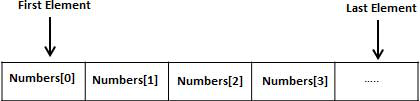

# 数组

## 1.数组定义

数组定义也是通过var 关键字，后面是数组的名字a，长度是10,类型是整型。表示：数组a能够存储10个整型数字。也就是说，数组a的长度是10。

我们可以通过len( )函数测试数组的长度，如下所示：

```go
var a [10] int
fmt.Println(len(a))
```

当定义完成数组a后，就在内存中开辟了10个连续的存储空间，每个数据都存储在相应的空间内，数组中包含的每个数据被称为数组元素（element），一个数组包含的元素个数被称为数组的长度。

注意：数组的长度只能是常量。以下定义是错误的：

```
var n int = 10
var a [a]int
```

## 2.数组赋值

数组定义完成之后，可以对数组进行赋值。

数组是通过下标来进行操作的，下标的范围是从0开始到数组长度减1的位置。

