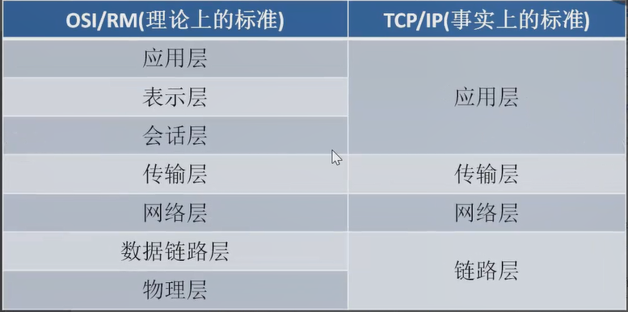

# 12.网络编程

## 12.1网络概述

### 12.1.1网络协议

从应用的角度除法，协议可以被理解为规则。

假设，A、B双方想传输文件。

规定:

- 第一次：传输文件名，接收方接收到文件名，应答OK给传输方；
- 第二次：发送文件的尺寸，接收方接收到数据再次应答一个OK；
- 第三次，传输文件内容。同样，接收方接受数据完成后应答OK标表示文件内容接受成功。

由此，无论A、B之间传递何种文件，都是通过三次数据传输完成 的。

A、B之间形成了一个最简单是数据传输规则。双方都按照此规则发送、接受数据。

A、B之间达成了这个相互遵循的规则就是协议。

这种仅在A、B之间被遵循的协议被称为**原始协议**。

当此协议被更多人采用时，不断的增加、改进、维护、完善。

最终形成一个稳定的、完整的文件传输协议、被广泛应用各种文件传输的过程中。

该协议就成为一个**标准协议**最早的FTP协议就是由此衍生而来。

协议分为四层和七层。我们主要学习的是四层的协议。

分层主要是减少复杂度。

协议越下面的曾，越靠近硬件；越上面的曾，越靠近用户。至于每一层叫什么名字，其实并不重要。（面视的时候，面试官可能会问每一层的名字）。只需要知道，互联网分为若干层即可。

- **物理层：**主要定义物理设备标准，如网线的接口类型、光前的接口类型、各种传输介质的传输速率等。他们主要作用是传输比特流（就是有1、0 转换为电流强弱来进行传输，到达目的地后转换为1、0，也就是我嫩常说的数模转换与模数转换）。这一层的数据叫做比特。

- **数据链路层：**定义了如何让格式化数据以帧为单位进行传输，以及如何让控制对物理介质的访问。这一层通常还提供错误检测和纠正，以确保数据的可靠传输。如：串口同学中使用到的 115200、8 、N 、1
- **网络层：**在位于不同地理位置的网络中连个主机系统之间提供连接和路径选择。Internet的发展史的从世界个站点访问信息的用户大大增加，二网络层正是管理这种

----

## 互联网协议：

- **ARP：**是正向地址解析协议（Address Resolution Protocol）,通过已知IP，寻找对应的主机MAC地址。

- **RARP：**是反向地址转换协议，通过MAC地址确定IP地址。

- **IP：**是因特网互联协议（Internet Protocol）

- **ICMP：**是Internet 控制报文协议（Internet Control Message Protocol）他是TCP / IP 协议族的一个子协议，用户在IP主机、路由器之间传递控制消息。

- **IGMP：**是Internet 组织管理协议（Internet Group Management Protocol），是因特网协议家族中的一个组播协议。该协议运行在主机和组播路由器之间。

- **TCP：**传输控制协议（Transmission Control Protocol），是一种面向连接的、可靠的、基于字节流的传输层通信协议。

- **UDP：**用户数据报协议（User Datagram Protocol）,是OSI参考模型中一种无连接的传输层协议，提供面向事务的简单不可靠信息传送服务。

- **HTTP：**超文本传输协议（Hyper Text Transfer Protocol）,是互联网上应用最广泛的一种网络协议。

- **FTP：**文件传输协议（File Transfer Protocol）

  

