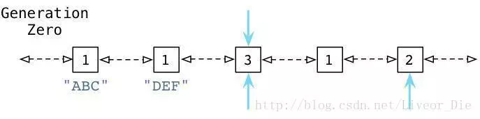

# Python的内存管理机制?

Python和其他语言不同的是python有**自动垃圾回收机制**。

比如java,c,c++等语言需要手动垃圾回收，

自动垃圾回收主要是以引用计数为主，标记清除、分代回收为辅的方式进行内存管理。

**引用计数**当一个对象的引用被创建或者复制时，对象的引用计数+1；当一个对象的引用被销毁是，对象的引用计数-1,；当对象的引用计数减少到为0的时候，就意味着没有人再去使用它，可以将其释放了。

**引用计数机制也有他的缺点和优点：**

优点：

实时性，引用为零时自动回收，并将回收的时间分摊到平时。

不像其他语言要特定的时间和时机进行回收。

缺点：

自动回收占用额外的内存。

循环引用问题，内存占满造成宕机。、

**循环引用是什么？**

循环引用时对象A和对象B互相调用形成循环引用。

这个会导致内存不断被占用，可能会导致宕机。

**可能造成循环引用对象的容器？**

list  set  dict  class  instance

**如何解决循环引用问题？**

解决循环引用的方法就是Python的标记清除机制和隔代（分代）回收机制。

**标记清除：**

如果两个对象引用计数都为1，但是仅仅存在他们之间的循环引用，那么这两个对象都会被回收，也就是说，他们的引用计数并非为0，但实际上有效的引用计数为0，所通过标记清除将循环引用摘掉，就会得出这两个有效的计数了。

**如果进行标记删除？**

通过两个容器来完成：死亡容器、存活容器

标记删除第一步：

对执行删除操作后的每个引用-1，此时c的引用为0,d的引用为0，把它们都放在死亡容器内。把那些引用仍然大于0的放到存活容器内。

标记删除第二步：

遍历存活容器，查看是否有存活的容器引用了死亡容器内的对象，如果有就把该对象（注意是对象，比如0x7f94bb602f80，不是对象的引用）从死亡容器内取出放到存活容器内。由于c,b没有对象引用他们经过这一个步骤他们还在死亡组（取出来了只是，有被存活容器内引用过的对象，没有被引用过的独享还在死亡容器内）。

标记清除第三步：

将死亡组所有对象删除，这样就完成对c,d的删除。

**分代回收：**

刚才提到自动垃圾回收的缺点就是会占用额外的内存，如果出现循环引用的问题，python不断的去自动回收（占用内存）最后可能导致宕机，引出了分代回收。

【比如当某个内存块在经过三次垃圾收集的清洗之后还在存活我们就将内存块M划到一个集合A中去，而新分配的内存都划分到集合B中去，当垃圾收集开始工作的时候，大多数情况只对集合B进行垃圾回收，而对集合A垃圾回收要隔上一段时间去进行，也就减少垃圾回收时候所占用的内存消耗，效率自然就提高了。这个过程中集合B的某些内存块由于存活时间长而会被转移到集合A中，当然，集合A中实际上也存在一些垃圾，这些垃圾的回收因为分代回收而被延迟。】

**调优方法：**

1. **手动垃圾回收**

   - 程序启动时候通过代码进行手动垃圾回收，而减轻自动回收的压力。

   - del语句，这个语句操作某个对象时候，并不是直接将对象的在内存中删除，而是将该对象的引用计数-1.

   - 当存在村换引用的时候，执行del函数，对应的del方法将不会执行。

     Python的自动垃圾回收机制也是引用计数-1，del也是-1，所以del并不会起到有效的作用。

     这时候使用垃圾回收接口-GC，来回收和显示这些不能删除的对象。

   对Python的垃圾回收进行调优的一个最简单的手段便是关闭自动回收，根据情况手动触发，例如在用Python开发游戏的时候，可以再一局游戏的开始关闭GC，然后在该局游戏结束后手动调用一次GC清理内存。这样就能避免游戏过程中GC造成的卡顿，但是缺点是在游戏过程中，可能因为内存溢出造成的游戏崩溃。

2. **调高垃圾回收的阈值**

   相比完全手动的垃圾回收，一个更温和的方法是调高垃圾回收的阈值。例如一个游戏可能在某一个时刻产生大量的子弹对象（假如2000个）。而此时Python的垃圾回收的threshold0为1000,。则不会触发垃圾回收，若干秒后，这些子弹命中目标被删除，内存引用计数机制自动释放，一次（可能很耗时的）垃圾回收被完全避免了。

   调高阈值的方法还能在一定程度上避免内存溢出的问题（但不能完全避免），同时可能减少客观的垃圾回收开销，根据具体项目的不同，甚至是程序输入的不同，合适的阈值也不同，因此需要反复调试找到一个合适的阈值，这也是一个调高阈值这种手段的一个缺点。

3. **避免循环引用**

   - 从代码的角度出发避免循环引用的问题。

   一个可能更好的方法使用良好的编程习惯尽可能的避免循环引用，两种常见的方法包括：

   1. 手动解循环引用使用弱引用。

      - **手动解循环引用**

        手动解循环引用指在编写代码时写好解开循环引用的diamante，在一个对象使用结束不需要调用时。

      - **使用弱引用**

        弱引用值当引用一个对象时，不增加该对象的引用计数，当需要用到该对象的时候，需要首先检查该对象是否存在，弱引用的实现方式有很多种，Python自带一个弱引用库weakref。

        除了使用Python自带的weakref库以外，通常我们可以根据自己项目的业务逻辑实现弱引用，例如在游戏里开发的时候，通常很多UI想都是有其唯一的ID的，在引用一个对象时我们可以保存其ID而不是直接引用该独享，在需要使用该对象的时候根据ID去检查对象是否存在。

**内存管理机制**

Python的内存管理内存分为四层：

其中layer2为内存池，layer3为对象缓冲池。Python的对象缓冲池layer3是建立在layer2基础上的。

**内存池：**

Python的内存机制呈现金字塔形状：

1. -1，-2层主要有操作系统进行操作；
2. 第0层是C中的malloc，free等内存分配和释放函数进行操作；
3. 第1层和第2层是内存池，有Python的接口函数PyMem_Malloc函数实现，当对象小于256K时有该层直接分配内存；
4. 第3层是最上层，也就是我们对Python对象的直接操作；

------------------

# Python内存管理机制

内存管理机制：一些高级语言，比如java、c#都会有垃圾回收机制，防止一些没有用0.的空间占用过多的内存最后导致程序宕掉。

c，c++里用户自己管理维护内存的方式，内存的申请、释放需要用户手动操作。

Python底层也指定了垃圾回收机制，因此普通用户在使用Python时，不用关心何时开启、执行垃圾回收机制。

Python的垃圾回收机制主要是引用**计数为主**、**标记清除**与**隔代回收**为辅的垃圾回收策略。

Python有一个私有堆空间来保存所有的对象和数据结构。作为开发者我无权访问它，是解释器在管理它，但是有了核心api后，我们可以访问一些工具。python内存管理器控制内存分配。

另外，内置垃圾回收器会回收使用所有的未使用内存，所以使其适用于堆空间。

## 一.引用计数，垃圾回收，内存引用计数池：

Python中，每一个东西都是对象，底层实现中都是一个pyobject；

**一切皆为对象。**

引用计数是一种非常高效的内存管理手段，当一个Pythn对象被引用时引用计数增加1，当其不再被一个变量所引用时则减1，当引用计数等于0时对象被删除。

其中，ob_refcnt属性记录着该对象的引用次数，当有东西引用该对象时，该属性会加1，引用该对象被删除时，该属性会减1，如果引用次数为0，就会触发垃圾回收机制

### 引用计数机制的优点：

实时性，只要没有了引用就释放资源。

不用像其他机制等到特定时机。

实时性还带来一个好处：处理回收内存的时间分摊到了平时。

### 引用计数机制的缺点：

1. 维护引用计数需要消耗一定资源。
2. 循环引用时，无法回收。正是因为这个原因，才需要通过标记清理和分代回收的方式来辅助引用计数。

## 二.垃圾回收：

### 1.引用计数

Python采用了类似于windows内核对象一样的方式来对内存进行管理。每一个对象，都维护这一个对指向该对象的引用计数。

当变量被绑定在一个对象上的时候，该变量的引用值就是1，（还有另外一些情况也会导致变量引用计数的增加），系统会自动维护这些标签，并定时扫描，当某标签的引用计数变为0的时候，该对象就会被回收。

Python不像c++,java等语言一样，他可以不用事先声明变量类型而对变量直接进行赋值。

对Python语言来讲，对象的类型和内存都是运行时确定的。

这也是为什么我们称python语言为动态类型的原因。

这里我们吧动态类型可以简单的归结为对变量内存地址的分配是在运行时自动判断变量类型并对变量进行赋值。

引用计数也是一种垃圾收集..机制，而且也是一种最直观，最简单的垃圾收集技术。当 Python中  的某个对象的引用计数降为 0时，说明没有任何引用指向该对象，该对象就成为要被回收的垃圾了。比如某个新建对象，它被分配给某个引用，对象的引用计数变为 1. 如果引用被删除，对象的引用计数为 0，那么该对象就可以被垃圾回收。如果出现循环引用的话，引用计数机制就不再起有效的作用了

### 2.标记清除

如果两个对象的引用计数都为 1，但是仅仅存在他们之间的循环引用，那么这两个对象都是需要被回收的，也就是说，它们的引用计数虽然表现为非0，但实际上有效的引用计数为0.所以先将循环引用摘掉，就会得出这两个对象的有效计数。

### 3.分代回收

从前面“标记-清除”这样的垃圾回收机制来看，这种垃圾收集机制所带来的的额外操作实际上与系统中总的内存块的数量是相关的，当需要回收的内存块越多是，垃圾检测带来的额外操作就越多，而垃圾回收的额外操作越来越少；反之，当需要回收的内存块地址越少是，垃圾检测就将比垃圾回收带来更少的额外操作。

#### 原理：

原理：
将系统中的所有内存块根据其存活时间划分为不同的集合，每一个集合就成为一个“代”，垃圾收集的频率随着“代”的存活时间的增大而减小。也就是说，活得越长的对象，就越不可能是垃圾，就应该减少对它的垃圾收集频率。那么如何来衡量这个存活时间：通常是利用几次垃圾收集动作来衡量，如果一个对象经过的垃圾收集次数越多，可以得出：该对象存活时间就越长

## 三.内存池：

**python的内存机制成金字塔形：**

1. 第-1，-2层主要有操作系统进行操作；

2. 第0层是C中的malloc，free等内存分配和释放函数进行操作；

3. 第1层和第2层是内存池，有python的接口函数PyMem_Malloc函数实现，当对象小于256字节时由该层直接分配内存；

4. 第三层是最上层，也就是我们对python对象的直接操作；

   

在C中如果频繁的调用malloc与free时，是会产生性能问题的，在加上频繁的分配和释放小块的内存会产生内存碎片。

**python在这里主要干的工作有：**

如果请求分配的内存在1~256字节之间就使用自己的内存管理系统，否则直接使用malloc。

这里还是会调用malloc分配内存，但每次回分配一块大小为256字节的大块内存。

【经由内存池登记的内存到最后还是会回收到内存池，并不会调用C的free释放掉，以便下次使用。对于简单的python对象，例如数值、字符串、元组（tuple不允许被更改）采用的是复制的方式（深拷贝），也就是说当讲另一个变量B赋值给变量A时，虽然A和B的内存空间仍然相同，但是当A的值发生变化时，会重新给A分配空间，A和B的地址变得不再相同。】

## 调优手段：

### 1.手动垃圾回收

### 2.调高垃圾回收阈值

### 3.避免循环引用

## 举个栗子：

当某些内存块M经过了3次垃圾收集的清洗之后还存活，我们就将内存块M划到一个集合A中去，而新分配的内存都划分到集合B中去，当垃圾收集开始工作时，大多数情况都只对集合B进行垃圾回收，而对集合A进行垃圾回收要隔上一段时间才去进行，这就使得垃圾回收机制需要处理的内存少了，效率自然就提高了。这个过程中，集合B中的某些内存块由于存活时间长而会被转移到集合A中，当然，集合A中实际上也存在一些垃圾，这些垃圾的回收因为这种分代的机制而被延迟。

# 博文：

图示引用计数缺点

t1与t2形成了循环引用，删除t1与t2之后，仍有引用计数，会导致内存空间不断被占用，进而导致宕机

为了解决这一问题，Python又引入了标记清除与隔代回收机制

## 标记清除机制

请注意在以上刚刚说到的例子中，我们以一个不是很常见的情况结尾：我们有一个“孤岛”或是一组未使用的、互相指向的对象，但是谁都没有外部引用。换句话说，我们的程序不再使用这些节点对象了，所以我们希望Python的垃圾回收机制能够足够智能去释放这些对象并回收它们占用的内存空间。但是这不可能，因为所有的引用计数都是1而不是0。Python的引用计数算法不能够处理互相指向自己的对象。

**“标记-清除”就是为了解决循环引用的问题**。可以包含其他对象引用的容器对象（比如：list，set，dict，class，instance）都可能产生循环引用。

我们必须承认上面的事实，如果两个对象的引用计数都为1，但是仅仅存在他们之间的循环引用，那么这两个对象都是需要被回收的，也就是说，它们的引用计数虽然表现为非0，但实际上有效的引用计数为0。我们必须先将循环引用摘掉，那么这两个对象的有效计数就现身了。假设两个对象为A、B，我们从A出发，因为它有一个对B的引用，则将B的引用计数减1；然后顺着引用达到B，因为B有一个对A的引用，同样将A的引用减1，这样，就完成了循环引用对象间环摘除。

但是这样就有一个问题，假设对象A有一个对象引用C，而C没有引用A，如果将C计数引用减1，而最后A并没有被回收，显然，我们错误的将C的引用计数减1，这将导致在未来的某个时刻出现一个对C的悬空引用。这就要求我们必须在A没有被删除的情况下复原C的引用计数，如果采用这样的方案，那么维护引用计数的复杂度将成倍增加。

原理：“标记-清除”采用了更好的做法，我们并不改动真实的引用计数，而是将集合中对象的引用计数复制一份副本，改动该对象引用的副本。对于副本做任何的改动，都不会影响到对象生命走起的维护。

这个计数副本的唯一作用是寻找root object集合（该集合中的对象是不能被回收的）。当成功寻找到root object集合之后，首先将现在的内存链表一分为二，**一条链表中维护root object集合，成为root链表，而另外一条链表中维护剩下的对象，成为unreachable链表**。之所以要剖成两个链表，是基于这样的一种考虑：现在的unreachable可能存在被root链表中的对象，直接或间接引用的对象，这些对象是不能被回收的，一旦在标记的过程中，发现这样的对象，就将其从unreachable链表中移到root链表中；当完成标记后，unreachable链表中剩下的所有对象就是名副其实的垃圾对象了，接下来的垃圾回收只需限制在unreachable链表中即可。

**那么GC又是如何判断哪些是活动对象哪些是非活动对象的呢？**

对象之间通过引用（指针）连在一起，构成一个有向图，对象构成这个有向图的节点，而引用关系构成这个有向图的边。从根对象（root object）出发，沿着有向边遍历对象，可达的（reachable）对象标记为活动对象，不可达的对象就是要被清除的非活动对象。根对象就是全局变量、调用栈、寄存器。

## 隔代回收机制

Python使用一种不同的链表来持续追踪活跃的对象。而不将其称之为“活跃列表”，Python的内部C代码将其称为零代(Generation Zero)。每次当你创建一个对象或其他什么值的时候，Python会将其加入零代链表：

从上边可以看到当我们创建ABC节点的时候，Python将其加入零代链表。请注意到这并不是一个真正的列表，并不能直接在你的代码中访问，事实上这个链表是一个完全内部的Python运行时。 相似的，当我们创建DEF节点的时候，Python将其加入同样的链表：

现在零代包含了两个节点对象。(他还将包含Python创建的每个其他值，与一些Python自己使用的内部值。)

检测循环引用

随后，Python会循环遍历零代列表上的每个对象，检查列表中每个互相引用的对象，根据规则减掉其引用计数。在这个过程中，Python会一个接一个的统计内部引用的数量以防过早地释放对象。

为了便于理解，来看一个例子：

从上面可以看到 ABC 和 DEF 节点包含的引用数为1.有三个其他的对象同时存在于零代链表中，蓝色的箭头指示了有一些对象正在被零代链表之外的其他对象所引用。(接下来我们会看到，Python中同时存在另外两个分别被称为一代和二代的链表)。这些对象有着更高的引用计数因为它们正在被其他指针所指向着。

接下来你会看到Python的GC是如何处理零代链表的。

##  导致引用计数+1的情况

1、对象被创建，例如a=23 

2、对象被引用，例如b=a 

3、对象被作为参数，传入到一个函数中，例如func(a) 

4、对象作为一个元素，存储在容器中，例如list1=[a,a]

## 导致引用计数-1的情况

1、对象的别名被显式销毁，例如del a 

2、对象的别名被赋予新的对象，例如a=24 

3、一个对象离开它的作用域，例如f函数执行完毕时，func函数中的局部变量（全局变量不会） 

4、对象所在的容器被销毁，或从容器中删除对象

## GC常用函数：

1、gc.set_debug(flags)设置gc的debug日志，一般设置为gc.DEBUG_LEAK

2、gc.collect([generation])显式进行垃圾回收，可以输入参数，0代表只检查第一代的对象，1代表检查一，二代的对象，2代表检查一，二，三代的对象，如果不传参数，执行一个full collection，也就是等于传2。 返回不可达（unreachable objects）对象的数目

3、gc.get_threshold()获取的gc模块中自动执行垃圾回收的频率。

4、gc.set_threshold(threshold0[, threshold1[, threshold2])设置自动执行垃圾回收的频率。

5、gc.get_count()获取当前自动执行垃圾回收的计数器，返回一个长度为3的列表

