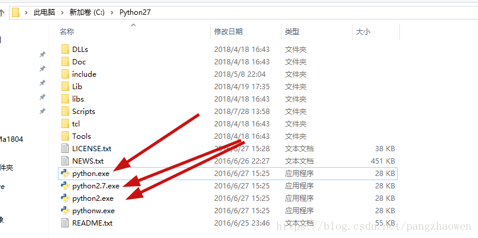
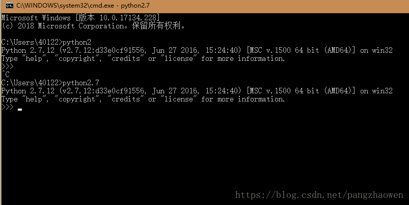

# Python2和Python3的区别？

## **一.核心差异**

1. Python3对unicode字符的原生支持。

   python2中使用ASCII码作为默认编码方式导致string有两种类型str和unicode，Python3只支持unicode的string。Python2和Python3字节和字符的对印关系为：

   | python2 | python3 | 表现 | 转换   | 作用 |
   | ------- | ------- | ---- | ------ | ---- |
   | str     | bytes   | 字节 | encode | 存储 |
   | unicode | str     | 字符 | decode | 显示 |

2. Python3 采用绝对路径的方式进行import.

   Python2中相对路径的import会导致标准库导入变得困难（想象一下，同一目录下有file.py，如何同时导入这个文件和标准库file）。

   Python3中这一点被修改，如果还需要导入同一目录文件必须使用绝对路径，否则只能使用相关导入的方式来进行导入。

3. Python2中存在老式类和新式类的区别。

   python3统一采用新式类。新式类声明要求继承object，必须采用新式类应用多继承。

4. Python3使用更加严格的缩进。

   Python2的缩进机制中，一个tab和八个space是等价的，所以在缩进中可以同时允许tab和space在代码中共存。这种等价机制导致部分IDE使用存在问题。

   Python3中一个tab只能找另一个tab来代替，因此tab和space共存会导致报错：

   <font color='red'>TabError: inconsistent use of tabs and spaces in indentation.</font>

## **2.废弃类差异。**

1. print语句被python3废弃，统一使用print函数。

2. exec语句被python3废弃，统一使用exec函数。

3. execfile语句被python3废弃，推荐使用

   ```
   exec(open("./filename").read())
   ```

4. 不相等操作符“<>”被Python3废弃，统一使用“!=”

5. long整数类被python3废弃，统一使用int

6. xrange函数被Python3废弃，统一使用range,Python3中range的机制也进行了修改并提高了大数据集生成效率。

7. Python3中这些方法不再返回list对象：

   dictionary关联的keys()、values()、item()、zip()、map()、filter()、但是可以通过list强行转换：

   ```
   mydict={"a":1,"b":2,"c":3}
   mydict.keys() #<built-in method keys of dict object at 0x000000000040B4C8>
   list(mydict.keys()) #['a', 'c', 'b']
   ```

8. 迭代器iterator的next()函数被Python3废弃，统一使用next(iterator)

9. raw_input函数被python3废弃，统一使用input函数。

10. 字典变量的has_key被python废弃，统一使用in关键词。

11. file函数被python3废弃，统一使用open来处理文件，可以通过io.IOBase检查文件类型。

12. apply函数被python3废弃。

13. 异常StandardError被Python3废弃，统一使用Exception

## **3.修改类差异**

1. 浮点数触发操作符“/”和“//”的区别：

   “/”：

   Python2：若为两格整形数进行运算，结果为整形，但若两个数中有一个为浮点数，则结果为浮点数；

   Python3：为真除法，运算结果不在根据参加运算的数据类型。

   “//”：

   Python2：返回小于除法运算结果的最大整数；从类型上将，与“/”运算符返回的逻辑一致。

   Python3：和Python2运算结果一样。

2. 异常抛出和捕获机制的区别。

   Python2：

   ```javascript
   raise IOError, "file error" #抛出异常
   except NameError, err:   #捕捉异常
   ```

   Python3：

   ```javascript
   raise IOError("file error") #抛出异常
   except NameError as err: #捕捉异常
   ```

   通过as的方法给异常起别名。

3. for循环中变量值区别。

   Python2，for循环会修改外部相同名称的变量值：

   ```javascript
   i = 1
   print （'comprehension: ', [i for i in range(5)]）
   print （'after: i =', i ） #i=4
   ```

   Python3，for循环不会修改外部相同名称变量的值

   ```python
   i = 1
   print （'comprehension: ', [i for i in range(5)]）
   print （'after: i =', i ） #i=1
   ```

4. round函数返回值区别

   Python2，round 函数返回 float 类型值

   ```
   isinstance(round(15.5),int) #True
   ```

   Python3，round 函数返回 int 类型值

   ```
    isinstance(round(15.5),float) #True
   ```

5. 比较操作符区别

   Python2 中任意两个对象都可以比较

   ```
   11 < 'test' #True
   ```

   Python3 中只有同一数据类型的对象可以比较

   ```
   11 < 'test' # TypeError: unorderable types: int() < str()
   ```

## **4.第三方工具包差异**

​		我们在pip 官方下载源 [**pypi** ](https://pypi.python.org/)搜索Python2.7 和Python3.5 的第三方工具包数可以发现，Python2.7版本对应的第三方工具类目数量是 28523,Python3.5 版本的数量是 12457，这两个版本在第三方工具包支持数量差距相当大。

​		我们从数据分析的应用角度列举了常见实用的第三方工具包（如下表），并分析这些工具包在Python2.7 和 Python3.5 的支持情况：

| **分类** | **工具名**    | **用途**                           |
| -------- | ------------- | ---------------------------------- |
| 数据收集 | scrapy        | 网页采集，爬虫                     |
| 数据收集 | scrapy-redis  | 分布式爬虫                         |
| 数据收集 | selenium      | web 测试，仿真浏览器               |
| 数据处理 | beautifulsoup | 网页解释库，提供 lxml 的支持       |
| 数据处理 | lxml          | xml 解释库                         |
| 数据处理 | xlrd          | excel 文件读取                     |
| 数据处理 | xlwt          | excel 文件写入                     |
| 数据处理 | xlutils       | excel 文件简单格式修改             |
| 数据处理 | pywin32       | excel 文件的读取写入及复杂格式定制 |
| 数据处理 | Python-docx   | Word 文件的读取写入                |
| 数据分析 | numpy         | 基于矩阵的数学计算库               |
| 数据分析 | pandas        | 基于表格的统计分析库               |

| **分类** | **工具名**   | **用途**                               |
| -------- | ------------ | -------------------------------------- |
| 数据分析 | scipy        | 科学计算库，支持高阶抽象和复杂模型     |
| 数据分析 | statsmodels  | 统计建模和计量经济学工具包             |
| 数据分析 | scikit-learn | 机器学习工具库                         |
| 数据分析 | gensim       | 自然语言处理工具库                     |
| 数据分析 | jieba        | 中文分词工具库                         |
| 数据存储 | MySQL-python | mysql 的读写接口库                     |
| 数据存储 | mysqlclient  | mysql 的读写接口库                     |
| 数据存储 | SQLAlchemy   | 数据库的 ORM 封装                      |
| 数据存储 | pymssql      | sql server 读写接口库                  |
| 数据存储 | redis        | redis 的读写接口                       |
| 数据存储 | PyMongo      | mongodb 的读写接口                     |
| 数据呈现 | matplotlib   | 流行的数据可视化库                     |
| 数据呈现 | seaborn      | 美观的数据可是湖库，基于 matplotlib    |
| 工具辅助 | jupyter      | 基于 web 的 python IDE，常用于数据分析 |
| 工具辅助 | chardet      | 字符检查工具                           |
| 工具辅助 | ConfigParser | 配置文件读写支持                       |
| 工具辅助 | requests     | HTTP 库，用于网络访问                  |

## **5.工具安装问题**

windows 环境

- Python2 无法安装 mysqlclient。
- Python3 无法安装 MySQL-python、 flup、functools32、Gooey、Pywin32、 webencodings。

- matplotlib 在 python3 环境中安装报错：

  <font color='red'>The following required packages can not be built:freetype, png。</font>

  需要手动下载安装源码包安装解决。

- scipy 在 Python3 环境中安装报错，

  <font color='red'>numpy.distutils.system_info.NotFoundError，</font>

  需要自己手工下载对应的安装包，依赖 numpy,pandas 必须严格根据 python 版本、操作系统、64 位与否。

  运行matplotlib 后发现基础包 numpy+mkl 安装失败，需要自己下载，国内暂无下载源

centos 环境下

- Python2 无法安装mysql-python 和mysqlclient 包，报错：

  <font color='red'>EnvironmentError: mysql_config not found，</font>

  解决方案是安装 mysql-devel 包解决。

- 使用 matplotlib 报错：

  <font color='red'>no module named _tkinter，</font> 

  安装 Tkinter、tk-devel、tc-devel 解决。

- pywin32 也无法在 centos 环境下安装。

## **6.切换**

电脑共存python2和pyhthon3，把安装目录下的python.exe文件改python2.exe和python3.exe，这样在调用的之后直接输入对应版本的就可。





 **Python3和Python2中 int 和 long的区别？**

 int(符号整数):通常被称为是整数或整数,没有小数点的正或负整数；

  long(长整数):无限大小的整数,这样写整数和一个大写或小写的L。

## **six库，解决python2的项目如何能够完全迁移到python3？**

SIX是用于python2与python3兼容的库。

它存在的目的是为了拥有无需修改即可在Python 2和Python 3上同时工作的代码。话虽这么说，但是这并不代表在Python 3中引用该库就可以轻松地跑Python 2的代码。

实际上，SIX是重定义了在python2和3中有差异的函数，例如dict的获取全部键值函数：在Python2中是

.iterkeys()

在Python3中是

.keys()

而在SIX中是

six.iterkeys(dict)（当然对应版本的原函数也能够使用）

也就是说，离开了SIX库的话你写的代码不论在Python2还是Python3中都无法运行。因此不是急于追求兼容性的话并不需要使用这个库。

安装：

https://github.com/benjaminp/six/releases

解压后双击steup.py即可。

 

### 使用

import six

之后按照SIX提供的语法书写即可写出pyhton2/3上兼容的代码。

 

six.PY2/ six.PY3 ：检查编译器版本是否为python2/3

 

以下是SIX提供的兼容语法：

常量定义：

six.class_types

可能的类类型。在Python 2中，这包含旧类和新类。在Python 3中，这只是新类。

 

six.integer_types

可能的整数类型。在Python 2中，这是long或 int，在Python 3中同int。

 

six.string_types

文本数据的可能类型。这是Python 2终点basestring()和 Python 3中的str。

 

six.text_type

用于表示（Unicode）文本数据的类型。这是unicode()在Python 2和Python 3中的str（Pyhon3对文本数据进行了整合，默认为Unicode文本数据）。

 

six.binary_type

代表二进制数据的类型。这是Python 2中的str和 Python 3中的bytes。

 

six.MAXSIZE

像list 或dict这样的容器的最大尺寸。这相当于 Python 2.6及更高版本（包括3.x）的sys.maxsize。请注意，这与sys.maxint Python 2 非常相似，但并不相同 。sys.maxint在Python 3中没有直接的等价物， 因为它的整数类型的长度仅受限于内存大小。

 

### 内置函数定义

1、six.get_unbound_function（meth）

获取非绑定方法的meth。在Python 3，不存在非绑定方法，所以这个功能只是返回meth不变。用法示例：

from six import get_unbound_function

 

class X(object):

def method(self):

pass

 

method_function = get_unbound_function(X.method)six.get_method_function（meth）

 

2、six.get_method_self（meth）

获取self绑定的方法的meth。

 

3、six.get_function_closure（func）

等效于Python 2.6+中的func.__closure__和Python 2.5中的func.func_closure

 

4、six.get_function_code（func）

获取与func关联的代码对象。等效于Python 2.6+中的 func.__code__和Python 2.5中的func.func_code。

 

5、six.get_function_defaults（func）

获取与func关联的默认元组。等效于Python 2.6+中的 func.__defaults__和Python 2.5中的func.func_defaults。

 

6、six.get_function_globals（func）

获取全局函数。等效于Python 2.6+中的func.__globals__和Python 2.5中的func.func_globals。

 

7、six.next（it） six.advance_iterator（it）

获取迭代器it的下一个项目。如果迭代器到达末尾，则会引发StopIteration。等效于Python 中的it.next()2和Python 3中的next(it).Python 2.6及更高版本具有内置next函数，因此只有需要兼容Python 2.5版本及以下时才需要该函数。

 

8、six.callable（obj ）

检查是否可以调用obj。callable标记已经在Python 3.2中有返回，所以只有在支持Python 3.0或3.1时才需要使用six的版本。

 

9、six.iterkeys（字典，** kwargs ）

返回字典键上的迭代器。等效于Python 2中的 dictionary.iterkeys()和Python 3中的dictionary.keys()。 kwargs被传递给底层方法。

 

10、six.itervalues（字典，** kwargs ）

返回字典值的迭代器。等效于Python 2中的dictionary.itervalues()和Python 3中的dictionary.values()。kwargs被传递给底层方法。

11、six.iteritems（字典，** kwargs ）

返回字典项目的迭代器。等效于Python 2中的 dictionary.iteritems()和Python 3中的dictionary.items()。 kwargs被传递给底层方法。

12、six.iterlists（字典，** kwargs ）

调用Python 2中的dictionary.iterlists() 或Python 3中的dictionary.lists()。原版的Python映射类型没有这种等效; 此方法旨在能够使用像Werkzeug’s这样的多值词典。 kwargs被传递给底层方法。

 

13、six.viewkeys（字典）

通过字典的键返回视图。等效于 Python 2.7中的dict.viewkeys()和Python 3中的dict.keys()。

 

14、six.viewvalues（字典）

通过字典的值返回视图。等效于 Python 2.7中的dict.viewvalues()和Python 3中的dict.values()。

 

15、six.viewitems（字典）

返回字典项目的视图。等效于 Python 2.7中的dict.viewitems()和Python 3中的dict.items()。

 

16、six.create_bound_method（func，obj ）

返回一个方法对象包装func并绑定到obj。在Python 2和Python 3上，这将返回一个types.MethodType对象。这个包装器函数存在的原因是，在Python 2中，MethodType构造函数需要传递obj的类。

 

17、six.create_unbound_method（func，cls ）

返回一个未绑定的方法对象包装函数。在Python 2中，这将返回一个types.MethodType对象。在Python 3中，未绑定的方法不存在，并且此包装将简单地返回func。

 

18、class six.Iterator

一个用于制作小型迭代器的类。其目的是将其划分子类并提供一种__next__方法。在Python 2中，Iterator 有一个方法：next。它只代表__next__。或许可以仅仅为 __next__取别名next。但是这会对重定义了 __next__的子类造成严重影响。Iterator在Python 3中是空的。（实际上，它只是被命名为object。）


列举 Python2和Python3的区别

1. print

​       在python2中，print被视为一个语句而不是一个函数，python3中，print()被视为一个函数

2. 整数的除法

   在python2中，键入的任何不带小数的数字，将被视为整数的编程类型。比如5/2=2，解决方法：5.0/2.0=2.5

​       在python3中，整数除法变得更直观 5/2=2.5

3. Unicode

​       Python 2 默认使用 ASCII 字母表；Python 3 默认使用 Unicode

4. 后续发展

​       Python 2.7 将在 2020 年失去后续的支持，

​       Python 3 将继续开发更多的功能和修复更多的错误。


#  为什么要放弃python2使用python3?

就一个问题字符串编码问题

作为一个新时代程序员为啥放着好用的不用非要去用不好的。

  

