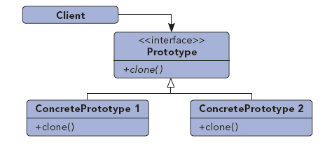
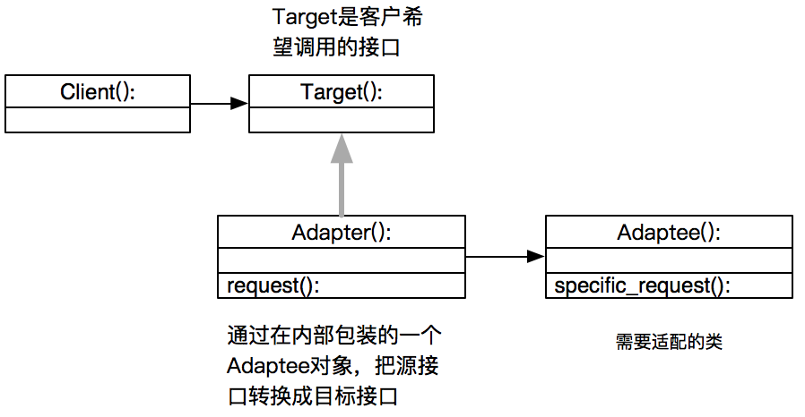
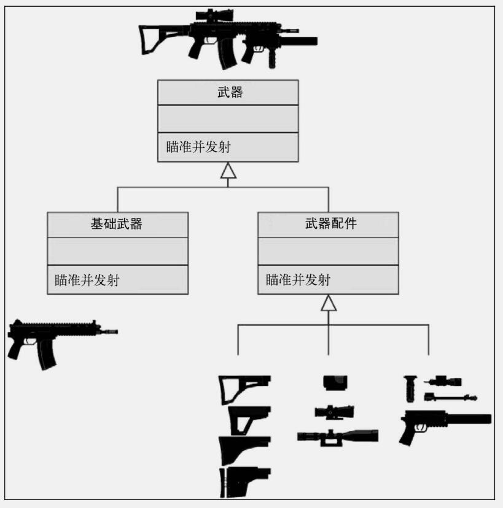

## 设计模式

Python设计模式 设计模式的定义:为了解决面向对象系统中重要和重复的设计封装在一起的一种代码实现框架,可以使得代码更加易于扩展和调用

四个基本要素:

:angry:模式名称,

:angry:问题,

:angry:解决方案,

:angry:效果

六大原则:

1. 开闭原则:

   一个软件实体,如类,模块和函数应该对扩展开发,对修改关闭.既软件实体应尽量在不修改原有代码的情况下进行扩展.

2. 里氏替换原则:

   所有引用父类的方法必须能透明的使用其子类的对象

3. 依赖倒置原则:

   高层模块不应该依赖底层模块,二者都应该依赖其抽象,抽象不应该依赖于细节,细节应该依赖抽象,换而言之,要针对接口编程而不是针对实现编程

4. 接口隔离原则:

   使用多个专门的接口,而不是使用单一的总接口,即客户端不应该依赖那些并不需要的接口

5. 迪米特法则:

   一个软件实体应该尽可能的少与其他实体相互作用

6. 单一直责原则:

   不要存在多个导致类变更的原因.即一个类只负责一项职责

   

创建型模式是处理对象创建的设计模式，试图根据实际情况使用合适的方式创建对象。基本的对象创建方式可能会导致设计上的问题，或增加设计的复杂度。创建型模式通过以某种方式控制对象的创建来解决问题。

创建型模式有两个主导思想构成。一是将系统使用的具体类型封装起来，二是隐藏这些具体类的实例创建和结合的方式。

1. 创建型模式包括:单例模式，抽象工厂模式，建造者模式，工厂模式，原型模式。

2. 结构性模式:适配器模式，桥接模式，组合模式，外观模式，享元模式，代理模式。

3. 行为模式:模板方法模式，命令模式，迭代器模式，观察者模式，中介者模式，备忘录模式，解释器模式，状态模式，策略模式，职责链模式，访问者模式。


### 接口

定义:一种特殊的类,声明了若干方法,要求继承该接口的类必须实现这种方法

作用:限制继承接口的类的方法的名称及调用方式,隐藏了类的内部实现

```python
from abc import ABCMeta,abstractmethod

class Payment(metaclass=ABCMeta):
    @abstractmethod#定义抽象方法的关键字
    def pay(self,money):
        pass

    # @abstractmethod
    # def pay(self,money):
    #     raise NotImplementedError

class AiliPay(Payment):
    #子类继承接口,必须实现接口中定义的抽象方法,否则不能实例化对象
    def pay(self,money):
        print('使用支付宝支付%s元'%money)

class ApplePay(Payment):
    def pay(self,money):
        print('使用苹果支付支付%s元'%money)
```

### 单例模式

定义:保证一个类只有一个实例,并提供一个访问它的全局访问点

适用场景:当一个类只能有一个实例而客户可以从一个众所周知的访问点访问它时

优点:对唯一实例的受控访问,相当于全局变量,但是又可以防止此变量被篡改

```
class Singleton(object):
    #如果该类已经有了一个实例则直接返回,否则创建一个全局唯一的实例
    def __new__(cls, *args, **kwargs):
        if not hasattr(cls,'_instance'):
            cls._instance = super(Singleton,cls).__new__(cls)
        return cls._instance

class MyClass(Singleton):
    def __init__(self,name):
        if name:
            self.name = name

a = MyClass('a')
print(a)
print(a.name)

b = MyClass('b')
print(b)
print(b.name)

print(a)
print(a.name)
```

### 工厂模式（celery）

定义:不直接向客户暴露对象创建的实现细节,而是通过一个工厂类来负责创建产品类的实例

角色:工厂角色,抽象产品角色,具体产品角色

优点:隐藏了对象创建代码的细节,客户端不需要修改代码

缺点:违反了单一职责原则,将创建逻辑集中到一个工厂里面,当要添加新产品时,违背了开闭原则

```
from abc import ABCMeta,abstractmethod

class Payment(metaclass=ABCMeta):
    #抽象产品角色
    @abstractmethod
    def pay(self,money):
        pass


class AiliPay(Payment):
    #具体产品角色
    def __init__(self,enable_yuebao=False):
        self.enable_yuebao = enable_yuebao

    def pay(self,money):
        if self.enable_yuebao:
            print('使用余额宝支付%s元'%money)
        else:
            print('使用支付宝支付%s元'%money)

class ApplePay(Payment):
    # 具体产品角色
    def pay(self,money):
        print('使用苹果支付支付%s元'%money)

class PaymentFactory:
    #工厂角色
    def create_payment(self,method):
        if method == 'alipay':
            return AiliPay()
        elif method == 'yuebao':
            return AiliPay(True)
        elif method == 'applepay':
            return ApplePay()
        else:
            return NameError

p = PaymentFactory()
f = p.create_payment('yuebao')
f.pay(100)
```

### 观察者模式

定义:定义对象间的一种一对多的依赖关系,当一个对象的状态发生改变时,所有依赖它的对象都会得到通知并被自动更新.观察者模式又称为'发布订阅'模式

角色:抽象主题,具体主题(发布者),抽象观察者,具体观察者(订阅者)

适用场景:当一个抽象模型有两个方面,其中一个方面依赖于另一个方面.将两者封装在独立的对象中以使它们各自独立的改变和复用

当一个对象的改变需要同时改变其他对象,而且不知道具体有多少对象以待改变

当一个对象必须通知其他对象,而又不知道其他对象是谁,即这些对象之间是解耦的

优点:目标和观察者之间的耦合最小,支持广播通信

缺点:多个观察者之间互不知道对方的存在,因此一个观察者对主题的修改可能造成错误的更新

```
from abc import ABCMeta, abstractmethod

#抽象主题
class Oberserver(metaclass=ABCMeta):
    @abstractmethod
    def update(self):
        pass

#具体主题
class Notice:
    def __init__(self):
        self.observers = []

    def attach(self,obs):
        self.observers.append(obs)

    def detach(self,obs):
        self.observers.remove(obs)

    def notify(self):
        for obj in self.observers:
            obj.update(self)

#抽象观察者
class ManagerNotice(Notice):
    def __init__(self,company_info=None):
        super().__init__()
        self.__company_info = company_info

    @property
    def company_info(self):
        return self.__company_info

    @company_info.setter
    def company_info(self,info):
        self.__company_info = info
        self.notify()

#具体观察者
class Manager(Oberserver):
    def __init__(self):
        self.company_info = None
    def update(self,noti):
        self.company_info = noti.company_info

#消息订阅-发送
notice = ManagerNotice()

alex=Manager()
tony=Manager()

notice.attach(alex)
notice.attach(tony)
notice.company_info="公司运行良好"
print(alex.company_info)
print(tony.company_info)

notice.company_info="公司将要上市"
print(alex.company_info)
print(tony.company_info)

notice.detach(tony)
notice.company_info="公司要破产了，赶快跑路"
print(alex.company_info)
print(tony.company_info)
```


# 对设计模式的理解，简述你了解的设计模式？

设计模式是经过总结，优化的，对我们经常会碰到的一些编程问题的可重用解决方案。一个设计模式并不像一个类或一个库那样能够直接作用于我们的代码，反之，设计模式更为高级，它是一种必须在特定情形下实现的一种方法模板。 常见的是工厂模式和单例模式


# 列举出一些常用的设计模式？

## 1.创建型模式


### 工厂方法（Factory Method）

定义:不直接向客户暴露对象创建的实现细节,而是通过一个工厂类来负责创建产品类的实例

​     角色:工厂角色,抽象产品角色,具体产品角色

​     优点:隐藏了对象创建代码的细节,客户端不需要修改代码

​     缺点:违反了单一职责原则,将创建逻辑集中到一个工厂里面,当要添加新产品时,违背了开闭原则

​     定义:定义一个创建对象的接口(工厂接口),让子类决定实例化哪个接口

​     角色:抽象工厂角色,具体工厂角色,抽象产品角色,具体产品角色

​     适用场景:需要生产多种,大量复杂对象的时候,需要降低代码耦合度的时候,当系统中的产品类经常需要扩展的时候

​     优点:每个具体的产品都对应一个具体工厂,不需要修改工厂类的代码,工厂类可以不知道它所创建的具体的类,隐藏了对象创建的实现细节

​     缺点:每增加一个具体的产品类,就必须增加一个相应的工厂类

工厂模式是一个在软件开发中用来创建对象的设计模式。

工厂模式包涵一个超类。这个超类提供一个抽象化的接口来创建一个特定类型的对象，而不是决定哪个对象可以被创建。

为了实现此方法，需要创建一个工厂类创建并返回。 

当程序运行输入一个“类型”的时候，需要创建于此相应的对象。这就用到了工厂模式。在如此情形中，实现代码基于工厂模式，可以达到可扩展，可维护的代码。当增加一个新的类型，不在需要修改已存在的类，只增加能够产生新类型的子类。

**简短的说，当以下情形可以使用工厂模式：**

1.不知道用户想要创建什么样的对象

2.当你想要创建一个可扩展的关联在创建类与支持创建对象的类之间。

一个例子更能很好的理解以上的内容：

1. 我们有一个基类Person ，包涵获取名字，性别的方法 。有两个子类male 和female，可以打招呼。还有一个工厂类。
2.  工厂类有一个方法名getPerson有两个输入参数，名字和性别。
3.  用户使用工厂类，通过调用getPerson方法。

在程序运行期间，用户传递性别给工厂，工厂创建一个与性别有关的对象。因此工厂类在运行期，决定了哪个对象应该被创建

```python
class Person:
    def __init__(self):
        self.name = None
        self.gender = None

    def getName(self):
        return self.name

    def getGender(self):
        return self.gender

class Male(Person):
    def __init__(self, name):
        print "Hello Mr." + name

class Female(Person):
    def __init__(self, name):
        print "Hello Miss." + name

class Factory:
    def getPerson(self, name, gender):
        if gender == ‘M':
                return Male(name)
        if gender == 'F':
            return Female(name)


if __name__ == '__main__':
    factory = Factory()
    person = factory.getPerson("Chetan", "M")

```

```python
#!/usr/bin/env python
# -*- coding: utf-8 -*-
# __author__= 'luhj'

from abc import ABCMeta,abstractmethod

class Payment(metaclass=ABCMeta):
    #抽象产品
    @abstractmethod
    def pay(self,money):
        pass


class AliPay(Payment):
    #具体产品
    def pay(self,money):
        print('使用支付宝支付%s元'%money)

class ApplePay(Payment):
    def pay(self,money):
        print('使用苹果支付支付%s元'%money)

class PaymentFactory(metaclass=ABCMeta):
    #抽象工厂
    @abstractmethod
    def create_payment(self):
        pass

class AliPayFactory(PaymentFactory):
    #具体工厂
    def create_payment(self):
        return AliPay()

class ApplePayFactory(PaymentFactory):
    def create_payment(self):
        return ApplePay()

af = AliPayFactory()
ali = af.create_payment()
ali.pay(100)

#如果要新增支付方式
class WechatPay(Payment):
    def pay(self,money):
        print('使用微信支付%s元'%money)
        
class WechatPayFactory(PaymentFactory):
    def create_payment(self):
        return WechatPay()

w = WechatPayFactory()
wc = w.create_payment()
wc.pay(200)
```

```python
from abc import ABCMeta,abstractmethod

class Payment(metaclass=ABCMeta):
    #抽象产品角色
    @abstractmethod
    def pay(self,money):
        pass


class AiliPay(Payment):
    #具体产品角色
    def __init__(self,enable_yuebao=False):
        self.enable_yuebao = enable_yuebao

    def pay(self,money):
        if self.enable_yuebao:
            print('使用余额宝支付%s元'%money)
        else:
            print('使用支付宝支付%s元'%money)

class ApplePay(Payment):
    # 具体产品角色
    def pay(self,money):
        print('使用苹果支付支付%s元'%money)

class PaymentFactory:
    #工厂角色
    def create_payment(self,method):
        if method == 'alipay':
            return AiliPay()
        elif method == 'yuebao':
            return AiliPay(True)
        elif method == 'applepay':
            return ApplePay()
        else:
            return NameError

p = PaymentFactory()
f = p.create_payment('yuebao')
f.pay(100)
```


### 抽象工厂模式（Abstract Factory）

　  定义:定义一个工厂类接口,让工厂子类来创建一系列相关或相互依赖的对象

​     角色:抽象工厂角色,具体工厂角色,抽象产品角色,具体产品角色,客户端

​     适用场景:系统要独立于产品的创建和组合时,强调一系列相关产品的对象设计以便进行联合调试时,提供一个产品类库,想隐藏产品的具体实现时

​     优点:将客户端与类的具体实现相分离,每个工厂创建了一个完整的产品系列,易于交换产品.有利于产品的一致性

​     缺点:难以支持新种类的产品


 ```python
from abc import abstractmethod, ABCMeta

# ------抽象产品------
class PhoneShell(metaclass=ABCMeta):

    @abstractmethod
    def show_shell(self):
        pass

class CPU(metaclass=ABCMeta):
    @abstractmethod
    def show_cpu(self):
        pass

class OS(metaclass=ABCMeta):
    @abstractmethod
    def show_os(self):
        pass

# ------抽象工厂------
class PhoneFactory(metaclass=ABCMeta):

    @abstractmethod
    def make_shell(self):
        pass

    @abstractmethod
    def make_cpu(self):
        pass

    @abstractmethod
    def make_os(self):
        pass

# ------具体产品------
class SmallShell(PhoneShell):
    def show_shell(self):
        print('小手机壳')

class BigShell(PhoneShell):
    def show_shell(self):
        print('大手机壳')

class AppleShell(PhoneShell):
    def show_shell(self):
        print('苹果机壳')

class SnapDragonCPU(CPU):
    def show_cpu(self):
        print('骁龙CPU')

class MediaTekCPU(CPU):
    def show_cpu(self):
        print('联发科CPU')

class AppleCPU(CPU):
    def show_cpu(self):
        print('苹果CPU')

class Andriod(OS):
    def show_os(self):
        print('安卓系统')

class IOS(OS):
    def show_os(self):
        print('iOS系统')

# ------具体工厂------
class MiFactory(PhoneFactory):
    def make_shell(self):
        return BigShell()

    def make_os(self):
        return Andriod()

    def make_cpu(self):
        return SnapDragonCPU()

class HuaweiFactory(PhoneFactory):
    def make_shell(self):
        return SmallShell()

    def make_os(self):
        return Andriod()

    def make_cpu(self):
        return MediaTekCPU()

class AppleFactory(PhoneFactory):
    def make_shell(self):
        return AppleShell()

    def make_os(self):
        return IOS()

    def make_cpu(self):
        return AppleCPU()

# ------客户端------
class Phone:
    def __init__(self,shell,os,cpu):
        self.shell=shell
        self.os=os
        self.cpu=cpu

    def show_info(self):
        print('手机信息')
        self.cpu.show_cpu()
        self.shell.show_shell()
        self.os.show_os()

def make_phone(factory):
    cpu = factory.make_cpu()
    os = factory.make_os()
    shell = factory.make_shell()
    return Phone(shell,os,cpu)

p1 = make_phone(AppleFactory())
p1.show_info()
 ```


### 建造者模式（Builder）

​      定义:将一个复杂对象的构建与它的表示分离,使得同样的构建过程可以创建不同的表示

​     角色:抽象建造者,具体建造者,指挥者,产品

​     适用场景:当创建复杂对象的算法应该独立于对象的组成部分以及它的装配方式,当构造过程允许被构造的对象有不同的表示

​     优点:隐藏了一个产品的内部结构和装配过程,将构造代码与表示代码分开,可以对构造过程进行更精确的控制

将一个复杂对象的构建与它的表示分离，使得同样的构建过程可以创建不同的表示。

相关模式：思路和模板方法模式很像，模板方法是封装算法流程，对某些细节，提供接口由子类修改，建造者模式更为高层一点，将所有细节都交由子类实现

一个例子更能很好的理解以上的内容：

1. 有一个接口类，定义创建对象的方法。一个指挥员类，接受创造者对象为参数。两个创造者类，创建对象方法相同，内部创建可自定义
2. 一个指挥员，两个创造者(瘦子 胖子)，指挥员可以指定由哪个创造者来创造

```python
from abc import ABCMeta, abstractmethod


class Builder():
    __metaclass__ = ABCMeta

    @abstractmethod
    def draw_left_arm(self):
        pass

    @abstractmethod
    def draw_right_arm(self):
        pass

    @abstractmethod
    def draw_left_foot(self):
        pass

    @abstractmethod
    def draw_right_foot(self):
        pass

    @abstractmethod
    def draw_head(self):
        pass

    @abstractmethod
    def draw_body(self):
        pass


class Thin(Builder):
    def draw_left_arm(self):
        print '画左手'

    def draw_right_arm(self):
        print '画右手'

    def draw_left_foot(self):
        print '画左脚'

    def draw_right_foot(self):
        print '画右脚'

    def draw_head(self):
        print '画头'

    def draw_body(self):
        print '画瘦身体'


class Fat(Builder):
    def draw_left_arm(self):
        print '画左手'

    def draw_right_arm(self):
        print '画右手'

    def draw_left_foot(self):
        print '画左脚'

    def draw_right_foot(self):
        print '画右脚'

    def draw_head(self):
        print '画头'

    def draw_body(self):
        print '画胖身体'


class Director():
    def __init__(self, person):
        self.person=person

    def draw(self):
        self.person.draw_left_arm()
        self.person.draw_right_arm()
        self.person.draw_left_foot()
        self.person.draw_right_foot()
        self.person.draw_head()
        self.person.draw_body()


if __name__=='__main__':
    thin=Thin()
    fat=Fat()
    director_thin=Director(thin)
    director_thin.draw()
    director_fat=Director(fat)
    director_fat.draw()

建造者模式
```

```python
from abc import abstractmethod, ABCMeta

#------产品------
class Player:
    def __init__(self,face=None, body=None, arm=None, leg=None):
        self.face =face
        self.body=body
        self.arm=arm
        self.leg=leg

    def __str__(self):
        return '%s,%s,%s,%s'%(self.face,self.body,self.arm,self.leg)

#------建造者------
class PlayerBuilder(metaclass=ABCMeta):
    @abstractmethod
    def build_face(self):
        pass

    @abstractmethod
    def build_body(self):
        pass

    @abstractmethod
    def build_arm(self):
        pass

    @abstractmethod
    def build_leg(self):
        pass

    @abstractmethod
    def get_player(self):
        pass

#------具体建造者------
class BeautifulWoman(PlayerBuilder):
    def __init__(self):
        self.player=Player()

    def build_face(self):
        self.player.face = '白脸蛋'

    def build_body(self):
        self.player.body = '好身材'

    def build_arm(self):
        self.player.arm = '细胳膊'

    def build_leg(self):
        self.player.leg = '大长腿'

    def get_player(self):
        return self.player

#------指挥者------
class PlayerDirecter:
    def build_player(self,builder):
        builder.build_face()
        builder.build_body()
        builder.build_arm()
        builder.build_leg()
        return builder.get_player()

director = PlayerDirecter()
builder = BeautifulWoman()
p = director.build_player(builder)
print(p)
```


### 原型模式（Prototype）



用原型实例指定创建对象的种类，并且通过拷贝这些原型创建新的对象。
原型模式本质就是克隆对象，所以在对象初始化操作比较复杂的情况下，很实用，能大大降低耗时，提高性能，因为“不用重新初始化对象，而是动态地获得对象运行时的状态”。

浅拷贝（*Shallow Copy*）:指对象的字段被拷贝，而字段引用的对象不会被拷贝，拷贝的对象和源对象只是名称相同，但是他们共用一个实体。
深拷贝（*deep copy*）:对对象实例中字段引用的对象也进行拷贝。  

```python
import copy
from collections import OrderedDict


class Book:
    def __init__(self, name, authors, price, **rest):
        '''rest的例子有：出版商、长度、标签、出版日期'''
        self.name = name
        self.authors = authors
        self.price = price  # 单位为美元
        self.__dict__.update(rest)

    def __str__(self):
        mylist = []
        ordered = OrderedDict(sorted(self.__dict__.items()))
        for i in ordered.keys():
            mylist.append('{}: {}'.format(i, ordered[i]))
            if i == 'price':
                mylist.append('$')
            mylist.append('\n')
            return ''.join(mylist)


class Prototype:
    def __init__(self):
        self.objects = dict()

    def register(self, identifier, obj):
        self.objects[identifier] = obj

    def unregister(self, identifier):
        del self.objects[identifier]

    def clone(self, identifier, **attr):
        found = self.objects.get(identifier)
        if not found:
            raise ValueError('Incorrect object identifier: {}'.format(identifier))
        obj = copy.deepcopy(found)
        obj.__dict__.update(attr)
        return obj


def main():
    b1 = Book('The C Programming Language', ('Brian W. Kernighan', 'Dennis M.Ritchie'),
              price=118, publisher='Prentice Hall', length=228, publication_date='1978-02-22',
              tags=('C', 'programming', 'algorithms', 'data structures'))
    prototype = Prototype()
    cid = 'k&r-first'
    prototype.register(cid, b1)
    b2 = prototype.clone(cid, name='The C Programming Language(ANSI)', price=48.99,
                         length=274, publication_date='1988-04-01', edition=2)
    for i in (b1, b2):
        print(i)
    print("ID b1 : {} != ID b2 : {}".format(id(b1), id(b2)))


if __name__ == '__main__':
    main()

"""
>>> python3 prototype.py
authors: ('Brian W. Kernighan', 'Dennis M. Ritchie')
length: 228
name: The C Programming Language
price: 118$
publication_date: 1978-02-22
publisher: Prentice Hall
tags: ('C', 'programming', 'algorithms', 'data structures')


authors: ('Brian W. Kernighan', 'Dennis M. Ritchie')
edition: 2
length: 274
name: The C Programming Language (ANSI)
price: 48.99$
publication_date: 1988-04-01
publisher: Prentice Hall
tags: ('C', 'programming', 'algorithms', 'data structures')

ID b1 : 140004970829304 != ID b2 : 140004970829472
"""

原型模式
```


### 单例模式（Singleton）

​     定义:保证一个类只有一个实例,并提供一个访问它的全局访问点

​     适用场景:当一个类只能有一个实例而客户可以从一个众所周知的访问点访问它时

​     优点:对唯一实例的受控访问,相当于全局变量,但是又可以防止此变量被篡改

**单例模式（Singleton Pattern）**是一种常用的软件设计模式，该模式的主要目的是确保**某一个类只有一个实例存在**。当你希望在整个系统中，某个类只能出现一个实例时，单例对象就能派上用场。

比如，某个服务器程序的配置信息存放在一个文件中，客户端通过一个 AppConfig 的类来读取配置文件的信息。如果在程序运行期间，有很多地方都需要使用配置文件的内容，也就是说，很多地方都需要创建 AppConfig 对象的实例，这就导致系统中存在多个 AppConfig 的实例对象，而这样会严重浪费内存资源，尤其是在配置文件内容很多的情况下。事实上，类似 AppConfig 这样的类，我们希望在程序运行期间只存在一个实例对象

```python
class Singleton(object):
    def __init__(self):
        pass

    def __new__(cls, *args, **kwargs):
        if not hasattr(Singleton, "_instance"): # 反射
            Singleton._instance = object.__new__(cls)
        return Singleton._instance

obj1 = Singleton()
obj2 = Singleton()
print(obj1, obj2) #<__main__.Singleton object at 0x004415F0> <__main__.Singleton object at 0x004415F0>
```

```python
class Singleton(object):
    #如果该类已经有了一个实例则直接返回,否则创建一个全局唯一的实例
    def __new__(cls, *args, **kwargs):
        if not hasattr(cls,'_instance'):
            cls._instance = super(Singleton,cls).__new__(cls)
        return cls._instance

class MyClass(Singleton):
    def __init__(self,name):
        if name:
            self.name = name

a = MyClass('a')
print(a)
print(a.name)

b = MyClass('b')
print(b)
print(b.name)

print(a)
print(a.name)
```


## 结构型模式：

### Adapter Class/Object（适配器）

定义：将一个接口转换为客户希望的另一个接口，该模式使得原本有接口不兼容二不能一起工作的哪些类可以一起工作。

角色：目标接口、待适配的类、适配器

适用场景：想使一个已经存在的类，但其接口不符合你的要求。相对一些已经存在的子类，不可能每一个都是用子类来进行适配，对象适配器可以适配器父类接口。

类适配器和对象适配器有不同的权衡。

类适配器

- 用一个具体的Adapter类对Adaptee和Target进行适配。结果是当我们想要匹配一个类似以及所有他的子类时，类Adapter将不能胜任工作。
- 使得Adapter可以重新定义Adaptee的部分行为，因为Adapter是Adaptee的一个子类。
- 仅仅引入了一个对象，并不需要额外的指针，以间接得到Adaptee.

对象适配器则

- 允许一个Adapter与多个Adaptee，即Adaptee本身以及他的所有子类（如果有子类的话）同时工作。

  Adapter也可以一次给所有的Adaptee添加功能。

- 使得重定义Adaptee的行为比较困难。这就需要生成Adaptee的子类并且使得Adapter引用这个子类而不是引用Adaptee本身。

 所谓适配器模式是指是一种接口适配技术，它可通过某个类来使用另一个接口与之不兼容的类，运用此模式，两个类的接口都无需改动。

适配器模式主要应用于希望复用一些现存的类，但是接口又与复用环境要求不一致的情况，比如在需要对早期代码复用一些功能等应用上很有实际价值。

解释二:

适配器模式(Adapter Pattern):将一个类的接口转换成为客户希望的另外一个接口.Adapter Pattern使得原本由于接口不兼容而不能一起工作的那些类可以一起工作.
应用场景:系统数据和行为都正确,但接口不符合时,目的是使控制范围之外的一个原有对象与某个接口匹配,适配器模式主要应用于希望复用一些现存的类,但接口又与复用环境不一致的情况



```python
class Target(object):
    def request(self):
        print "普通请求"

class Adaptee(object):

    def specific_request(self):
        print "特殊请求"

class Adapter(Target):

    def __init__(self):
        self.adaptee = Adaptee()

    def request(self):
        self.adaptee.specific_request()

if __name__ == "__main__":
    target = Adapter()
    target.request()

适配器模式
```

```python
from abc import abstractmethod, ABCMeta


class Payment(metaclass=ABCMeta):
    @abstractmethod
    def pay(self, money):
        raise NotImplementedError


class Alipay(Payment):
    def pay(self, money):
        print("支付宝支付%s元"%money)


class ApplePay(Payment):
    def pay(self, money):
        print("苹果支付%s元"%money)

#------待适配的类-----
class WeChatPay:
    def fuqian(self,money):
        print('微信支付%s元'%money)

#------类适配器------
class RealWeChatPay(Payment,WeChatPay):
    def pay(self, money):
        return self.fuqian(money)

#-----对象适配器-----
class PayAdapter(Payment):
    def __init__(self,payment):
        self.payment=payment
    def pay(self, money):
        return self.payment.fuqian(money)

#RealWeChatPay().pay(100)

p=PayAdapter(WeChatPay())
p.pay(200)
```


### Bridge（桥接）


### Composite（组合）

 定义:将对象组合成树形结构以表示'部分-整体'的层次结构.组合模式使得用户对单个对象和组合对象的使用具有一致性

​     角色:抽象组件,叶子组件,复合组件,客户端

​     适用场景:表示对象的'部分-整体'层次结构,希望用户忽略组合对象与单个对象的不同,用户统一使用组合结构中的所有对象

​     优点:定义了包含基本对象和组合对象的类层次结构,简化客户端代码,即客户端可以一致的使用组合对象和单个对象,更容易新增新类型的组件

​     缺点:很难限制组合中的组件

```python
from abc import abstractmethod, ABCMeta

#-------抽象组件--------
class Graph(metaclass=ABCMeta):

    @abstractmethod
    def draw(self):
        pass

    @abstractmethod
    def add(self,graph):
        pass

    def get_children(self):
        pass

#---------叶子组件--------
class Point(Graph):
    def __init__(self,x,y):
        self.x = x
        self.y = y

    def draw(self):
        print(self)

    def add(self,graph):
        raise TypeError

    def get_children(self):
        raise TypeError

    def __str__(self):
        return '点(%s,%s)'%(self.x,self.y)


class Line(Graph):

    def __init__(self,p1,p2):
        self.p1 = p1
        self.p2 = p2

    def draw(self):
        print(self)

    def add(self,graph):
        raise TypeError

    def get_children(self):
        raise TypeError

    def __str__(self):
        return '线段(%s,%s)'%(self.p1,self.p2)

#--------复合组件---------
class Picture(Graph):
    def __init__(self):
        self.children = []

    def add(self,graph):
        self.children.append(graph)

    def get_children(self):
        return self.children

    def draw(self):
        print('-----复合图形-----')
        for g in self.children:
            g.draw()
        print('结束')


#---------客户端---------
pic1 = Picture()
point = Point(2,3)
pic1.add(point)
pic1.add(Line(Point(1,2),Point(4,5)))
pic1.add(Line(Point(0,1),Point(2,1)))

pic2 = Picture()
pic2.add(Point(-2,-1))
pic2.add(Line(Point(0,0),Point(1,1)))

pic = Picture()
pic.add(pic1)
pic.add(pic2)

pic.draw()
```


### Decorator（装饰）

 该模式虽名为修饰器，但这并不意味着它应该只用于让产品看起来更漂亮。修饰器模式通常用于扩展一个对象的功能。这类扩展的实际例子有，给枪加一个消音器、使用不同的照相机镜头



```python
import functools
def memoize(fn):
    known = dict()
    @functools.wraps(fn)
    def memoizer(*args):
        if args not in known:
            known[args] = fn(*args)
        return known[args]
    return memoizer
@memoize
def nsum(n):
    '''返回前n个数字的和'''
    assert(n >= 0), 'n must be >= 0'
    return 0 if n == 0 else n + nsum(n-1)
@memoize
def fibonacci(n):
    '''返回斐波那契数列的第n个数'''
    assert(n >= 0), 'n must be >= 0'
    return n if n in (0, 1) else fibonacci(n-1) + fibonacci(n-2)
if __name__ == '__main__':
    from timeit import Timer
    measure = [ {'exec':'fibonacci(100)', 'import':'fibonacci',
    'func':fibonacci},{'exec':'nsum(200)', 'import':'nsum',
    'func':nsum} ]
    for m in measure:
        t = Timer('{}'.format(m['exec']), 'from __main__ import{}'.format(m['import']))
        print('name: {}, doc: {}, executing: {}, time:{}'.format(m['func'].__name__, m['func'].__doc__,m['exec'], t.timeit()))

"""
>>> python3 mymath.py
name: fibonacci, doc: Returns the nth number of the Fibonacci
sequence, executing: fibonacci(100), time: 0.4169441329995607
name: nsum, doc: Returns the sum of the first n numbers,
executing: nsum(200), time: 0.4160157349997462
"""
```


### Facade（外观）

 外观模式又叫做门面模式。在面向对象程序设计中，解耦是一种推崇的理念。但事实上由于某些系统中过于复杂，从而增加了客户端与子系统之间的耦合度。例如：在家观看多媒体影院时，更希望按下一个按钮就能实现影碟机，电视，音响的协同工作，而不是说每个机器都要操作一遍。这种情况下可以采用外观模式，即引入一个类对子系统进行包装，让客户端与其进行交互。

外观模式(Facade Pattern)：外部与一个子系统的通信必须通过一个统一的外观对象进行，为子系统中的一组接口提供一个一致的界面，外观模式定义了一个高层接口，这个接口使得这一子系统更加容易使用。外观模式又称为门面模式，它是一种对象结构型模式。

```python
from enum import Enum
from abc import ABCMeta, abstractmethod

State = Enum('State', 'new running sleeping restart zombie')


class User:
    pass


class Process:
    pass


class File:
    pass


class Server(metaclass=ABCMeta):
    @abstractmethod
    def __init__(self):
        pass

    def __str__(self):
        return self.name

    @abstractmethod
    def boot(self):
        pass

    @abstractmethod
    def kill(self, restart=True):
        pass


class FileServer(Server):
    def __init__(self):
        '''初始化文件服务进程要求的操作'''
        self.name = 'FileServer'
        self.state = State.new

    def boot(self):
        print('booting the {}'.format(self))
        '''启动文件服务进程要求的操作'''
        self.state = State.running

    def kill(self, restart=True):
        print('Killing {}'.format(self))
        '''终止文件服务进程要求的操作'''
        self.state = State.restart if restart else State.zombie

    def create_file(self, user, name, permissions):
        '''检查访问权限的有效性、用户权限等'''
        print("trying to create the file '{}' for user '{}' with permissions{}".format(name, user, permissions))


class ProcessServer(Server):
    def __init__(self):
        '''初始化进程服务进程要求的操作'''
        self.name = 'ProcessServer'
        self.state = State.new

    def boot(self):
        print('booting the {}'.format(self))
        '''启动进程服务进程要求的操作'''
        self.state = State.running

    def kill(self, restart=True):
        print('Killing {}'.format(self))
        '''终止进程服务进程要求的操作'''
        self.state = State.restart if restart else State.zombie

    def create_process(self, user, name):
        '''检查用户权限和生成PID等'''
        print("trying to create the process '{}' for user '{}'".format(name, user))


class WindowServer:
    pass


class NetworkServer:
    pass


class OperatingSystem:
    '''外观'''

    def __init__(self):
        self.fs = FileServer()
        self.ps = ProcessServer()

    def start(self):
        [i.boot() for i in (self.fs, self.ps)]

    def create_file(self, user, name, permissions):
        return self.fs.create_file(user, name, permissions)

    def create_process(self, user, name):
        return self.ps.create_process(user, name)


def main():
    os = OperatingSystem()
    os.start()
    os.create_file('foo', 'hello', '-rw-r-r')
    os.create_process('bar', 'ls /tmp')


if __name__ == '__main__':
    main()

"""
booting the FileServer
booting the ProcessServer
trying to create the file 'hello' for user 'foo' with permissions-rw-r-r
trying to create the process 'ls /tmp' for user 'bar'
"""

外观模式
```


### Flyweight（享元）

   运用共享技术有效地支持大量细粒度的对象。
内部状态：享元对象中不会随环境改变而改变的共享部分。比如围棋棋子的颜色。
外部状态：随环境改变而改变、不可以共享的状态就是外部状态。比如围棋棋子的位置。

应用场景：程序中使用了大量的对象，如果删除对象的外部状态，可以用相对较少的共享对象取代很多组对象，就可以考虑使用享元模式。  

```python
import random
from enum import Enum
TreeType = Enum('TreeType', 'apple_tree cherry_tree peach_tree')

class Tree:
    pool = dict()
    def __new__(cls, tree_type):
        obj = cls.pool.get(tree_type, None)
        if not obj:
            obj = object.__new__(cls)
            cls.pool[tree_type] = obj
            obj.tree_type = tree_type
        return obj

    def render(self, age, x, y):
        print('render a tree of type {} and age {} at ({}, {})'.format(self.tree_type, age, x, y))


def main():
    rnd = random.Random()
    age_min, age_max = 1, 30 # 单位为年
    min_point, max_point = 0, 100
    tree_counter = 0
    for _ in range(10):
        t1 = Tree(TreeType.apple_tree)
        t1.render(rnd.randint(age_min, age_max),
                rnd.randint(min_point, max_point),
                rnd.randint(min_point, max_point))
        tree_counter += 1
    for _ in range(3):
        t2 = Tree(TreeType.cherry_tree)
        t2.render(rnd.randint(age_min, age_max),
                rnd.randint(min_point, max_point),
                rnd.randint(min_point, max_point))
        tree_counter += 1
    for _ in range(5):
        t3 = Tree(TreeType.peach_tree)
        t3.render(rnd.randint(age_min, age_max),
                    rnd.randint(min_point, max_point),
                    rnd.randint(min_point, max_point))
        tree_counter += 1

    print('trees rendered: {}'.format(tree_counter))
    print('trees actually created: {}'.format(len(Tree.pool)))
    t4 = Tree(TreeType.cherry_tree)
    t5 = Tree(TreeType.cherry_tree)
    t6 = Tree(TreeType.apple_tree)
    print('{} == {}? {}'.format(id(t4), id(t5), id(t4) == id(t5)))
    print('{} == {}? {}'.format(id(t5), id(t6), id(t5) == id(t6)))

main()

"""
render a tree of type TreeType.apple_tree and age 28 at (29, 80)
render a tree of type TreeType.apple_tree and age 28 at (38, 94)
render a tree of type TreeType.apple_tree and age 16 at (82, 84)
render a tree of type TreeType.apple_tree and age 18 at (43, 98)
render a tree of type TreeType.apple_tree and age 2 at (84, 72)
render a tree of type TreeType.apple_tree and age 16 at (89, 29)
render a tree of type TreeType.apple_tree and age 30 at (91, 53)
render a tree of type TreeType.apple_tree and age 12 at (92, 73)
render a tree of type TreeType.apple_tree and age 3 at (11, 54)
render a tree of type TreeType.apple_tree and age 1 at (34, 59)
render a tree of type TreeType.cherry_tree and age 11 at (67, 72)
render a tree of type TreeType.cherry_tree and age 27 at (65, 81)
render a tree of type TreeType.cherry_tree and age 27 at (10, 48)
render a tree of type TreeType.peach_tree and age 11 at (35, 38)
render a tree of type TreeType.peach_tree and age 3 at (58, 83)
render a tree of type TreeType.peach_tree and age 18 at (73, 50)
render a tree of type TreeType.peach_tree and age 24 at (94, 3)
render a tree of type TreeType.peach_tree and age 4 at (2, 9)
trees rendered: 18
trees actually created: 3
4866032 == 4866032? True
4866032 == 4742704? False

"""

享元模式
```


### Proxy（代理） 

定义:为其他对象提供一种代理以控制对特定对象的访问

​     角色:抽象实体,实体,代理

​     适用场景:远程代理(为远程的对象提供代理),虚代理(根据需要创建很大的对象,即懒加载),保护代理(控制对原始对象的访问,用于具有不同访问权限的对象)

​     优点:远程代理(可以隐藏对象位于远程地址空间的事实),虚代理(可对大对象的加载进行优化),保护代理(允许在访问一个对象时有一些附加的处理逻辑,例如权限控制)

```python
from abc import ABCMeta, abstractmethod

#抽象实体
class Subject(metaclass=ABCMeta):
    @abstractmethod
    def get_content(self):
        pass

#实体
class RealSubject(Subject):
    def __init__(self,filename):
        print('读取文件%s内容'%filename)
        f = open(filename)
        self.content = f.read()
        f.close()

    def get_content(self):
        return self.content

#远程代理
class ProxyA(Subject):
    def __init__(self,filename):
        self.subj =RealSubject(filename)
    def get_content(self):
        return self.subj.get_content()

#虚代理
class ProxyB(Subject):
    def __init__(self,filename):
        self.filename = filename
        self.subj = None
    def get_content(self):
        if not self.subj:
            self.subj = RealSubject(self.filename)
        return self.subj.get_content()

#保护代理
class ProxyC(Subject):
    def __init__(self,filename):
        self.subj = RealSubject(filename)
    def get_content(self):
        return '???'


#客户端
filename = 'abc.txt'
username = input('>>')
if username!='alex':
    p=ProxyC(filename)
else:
    p=ProxyB(filename)

print(p.get_content())
```


## 行为型：

### Interpreter（解释器）

 

### Template Method（模板方法）

 定义:定义一个操作中算法的骨架,将一些步骤延迟到子类中,模板方法使得子类可以不改变一个算法的结构即可重定义该算法某些特定的步骤

​     角色:抽象类(定义抽象的原子操作,实现一个模板方法作为算法的骨架),具体类(实现原子操作)

​     适用场景:一次性实现一个算法不变的部分,各个子类的公共行为,应该被提取出来集中到公共的父类中以避免代码重复,控制子类扩展

 ```python
from abc import ABCMeta, abstractmethod

#----抽象类-----
class IOHandler(metaclass=ABCMeta):
    @abstractmethod
    def open(self,name):
        pass

    @abstractmethod
    def deal(self,change):
        pass

    @abstractmethod
    def close(self):
        pass
    #在父类中定义了子类的行为
    def process(self,name,change):
        self.open(name)
        self.deal(change)
        self.close()

#子类中只需要实现部分算法,而不需要实现所有的逻辑
#-----具体类--------
class FileHandler(IOHandler):
    def open(self,name):
        self.file = open(name,'w')

    def deal(self,change):
        self.file.write(change)

    def close(self):
        self.file.close()

f = FileHandler()
f.process('abc.txt','hello')
 ```


### Chain of Responsibility（责任链）

​      定义:使多个对象有机会处理请求,从而避免请求的发布者和接收者之间的耦合关系,将这些对象连成一条链,并沿着这条链传递该请求,直到有一个对象能处理它为止

​     角色:抽象处理者,具体处理者,客户端

​     适用场景:有多个对象可以处理一个请求,哪个对象处理由运行时决定

​     优点:降低耦合度,一个对象无需知道是其他哪一个对象处理其请求

​     缺点:请求不保证被接收,链的末端没有处理或链配置错误

```python
from abc import ABCMeta, abstractmethod

class Handler(metaclass=ABCMeta):
    @abstractmethod
    def handel_leave(self,day):
        pass

class GeneralManagerHandler(Handler):
    def handel_leave(self,day):
        if day < 10:
            print('总经理批准请假%s天'%day)

        else:
            print('不能请假')

class DepartmentManagerHandler(Handler):
    def __init__(self):
        self.successor = GeneralManagerHandler()
    def handel_leave(self,day):
        if day < 7:
            print('部门经理批准请假%s天' % day)
        else:
            print('部门经理无权批假')
            self.successor.handel_leave(day)

class ProjectDirectorHandler(Handler):
    def __init__(self):
        self.successor = DepartmentManagerHandler()
    def handel_leave(self,day):
        if day < 3:
            print('项目经理批准请假%s天' % day)
        else:
            print('项目经理无权批假')
            self.successor.handel_leave(day)

day = 6
h = ProjectDirectorHandler()
h.handel_leave(day)
```

```python
from abc import ABCMeta, abstractmethod
#--模仿js事件处理
class Handler(metaclass=ABCMeta):
    @abstractmethod
    def add_event(self,func):
        pass

    @abstractmethod
    def handler(self):
        pass

class BodyHandler(Handler):
    def __init__(self):
        self.func = None

    def add_event(self,func):
        self.func = func

    def handler(self):
        if self.func:
            return self.func()
        else:
            print('已经是最后一级,无法处理')


class ElementHandler(Handler):

    def __init__(self,successor):
        self.func = None
        self.successor = successor

    def add_event(self,func):
        self.func = func

    def handler(self):
        if self.func:
            return self.func()
        else:
            return self.successor.handler()


#客户端
body = {'type': 'body', 'name': 'body', 'children': [], 'father': None}

div = {'type': 'div', 'name': 'div', 'children': [], 'father': body}

a = {'type': 'a', 'name': 'a', 'children': [], 'father': div}

body['children'] = div
div['children'] = a

body['event_handler'] = BodyHandler()
div['event_handler'] = ElementHandler(div['father']['event_handler'])
a['event_handler'] = ElementHandler(a['father']['event_handler'])

def attach_event(element,func):
    element['event_handler'].add_event(func)

#测试
def func_div():
    print("这是给div的函数")

def func_a():
    print("这是给a的函数")

def func_body():
    print("这是给body的函数")

attach_event(div,func_div)
#attach_event(a,func_a)
attach_event(body,func_body)

a['event_handler'].handler()
```


### Command（命令）

 

### Iterator（迭代器）

​      定义:提供一种方法可顺序访问一个聚合对象中的各个元素,而又不需要暴露该对象的内部指示

​     适用场景:实现方法`__iter__,__next__`

```python
class LinkedList:
    class Node:
        def __init__(self,item=None):
            self.item=item
            self.next=None
    class LinkedListIterator:
        def __init__(self,node):
            self.node = node
        #实现next方法,返回下一个元素
        def __next__(self):
            if self.node:
                cur_node = self.node
                self.node = cur_node.next
                return cur_node.item

        def __iter__(self):
            return self
    def __init__(self,iterable=None):
        self.head = LinkedList.Node(0)
        self.tail = self.head
        self.extend(iterable)

    #链表尾部追加元素
    def append(self,obj):
        s = LinkedList.Node(obj)
        self.tail.next = s
        self.tail = s
    #链表自动增加长度
    def extend(self,iterable):
        for obj in iterable:
            self.append(obj)
        self.head.item += len(iterable)

    def __iter__(self):
        return self.LinkedListIterator(self.head.next)

    def __len__(self):
        return self.head.item

    def __str__(self):
        return '<<'+', '.join(map(str,self)) + '>>'

li = [i for i in range(100)]
lk = LinkedList(li)
print(lk)
```


### Mediator（中介者）


### Memento（备忘录）

 

### Observer（观察者）

​      定义:定义对象间的一种一对多的依赖关系,当一个对象的状态发生改变时,所有依赖它的对象都会得到通知并被自动更新.观察者模式又称为'发布订阅'模式

​     角色:抽象主题,具体主题(发布者),抽象观察者,具体观察者(订阅者)

​     适用场景:当一个抽象模型有两个方面,其中一个方面依赖于另一个方面.将两者封装在独立的对象中以使它们各自独立的改变和复用

​                    当一个对象的改变需要同时改变其他对象,而且不知道具体有多少对象以待改变

​                    当一个对象必须通知其他对象,而又不知道其他对象是谁,即这些对象之间是解耦的

​     优点:目标和观察者之间的耦合最小,支持广播通信

​     缺点:多个观察者之间互不知道对方的存在,因此一个观察者对主题的修改可能造成错误的更新

```python
from abc import ABCMeta, abstractmethod

#抽象主题
class Oberserver(metaclass=ABCMeta):
    @abstractmethod
    def update(self):
        pass

#具体主题
class Notice:
    def __init__(self):
        self.observers = []

    def attach(self,obs):
        self.observers.append(obs)

    def detach(self,obs):
        self.observers.remove(obs)

    def notify(self):
        for obj in self.observers:
            obj.update(self)

#抽象观察者
class ManagerNotice(Notice):
    def __init__(self,company_info=None):
        super().__init__()
        self.__company_info = company_info

    @property
    def company_info(self):
        return self.__company_info

    @company_info.setter
    def company_info(self,info):
        self.__company_info = info
        self.notify()

#具体观察者
class Manager(Oberserver):
    def __init__(self):
        self.company_info = None
    def update(self,noti):
        self.company_info = noti.company_info

#消息订阅-发送
notice = ManagerNotice()

alex=Manager()
tony=Manager()

notice.attach(alex)
notice.attach(tony)
notice.company_info="公司运行良好"
print(alex.company_info)
print(tony.company_info)

notice.company_info="公司将要上市"
print(alex.company_info)
print(tony.company_info)

notice.detach(tony)
notice.company_info="公司要破产了，赶快跑路"
print(alex.company_info)
print(tony.company_info)
```


### State（状态）

 

### Strategy（策略）

​      定义:定义一系列的算法把它们一个个封装起来,并且使它们可相互替换.该模式使得算法可独立于使用它的客户而变化

​     角色:抽象策略,具体策略,上下文

​     适用场景:许多相关的类仅仅是行为有异,需使用一个算法的不同变体,算法使用了客户端无需知道的数据,一个类中的多个行为以多个条件语句存在可以将其封装在不同的策略类中

​     优点:定义了一系列可重用的算法和行为,消除了一些条件语句,可提供相同行为的不同实现

​     缺点:客户必须了解不同的策略,策略与上下文之间的通信开销,增加了对象的数目

```python
from abc import ABCMeta, abstractmethod
import random

#抽象策略
class Sort(metaclass=ABCMeta):
    @abstractmethod
    def sort(self,data):
        pass

#具体策略
class QuickSort(Sort):

    def quick_sort(self,data,left,right):
        if left<right:
            mid = self.partation(data,left,right)
            self.quick_sort(data,left,mid-1)
            self.quick_sort(data,mid+1,right)

    def partation(self,data,left,right):
        tmp = data[left]
        while left < right:
            while left<right and data[right]>=tmp:
                right -= 1
            data[left] = data[right]

            while left<right and data[left]<=tmp:
                left += 1
            data[right] = data[left]
        data[left] = tmp
        return left

    def sort(self,data):
        print("快速排序")
        return self.quick_sort(data,0,len(data)-1)

class MergeSort(Sort):
    def merge(self,data,low,mid,high):
        i = low
        j = mid+1
        ltmp = []
        while i <= mid and j <= high:
            if data[i] <= data[j]:
                ltmp.append(data[i])
                i+=1
            else:
                ltmp.append(data[j])
                j+=1
        while i <= mid:
            ltmp.append(data[i])
            i+=1
        while j <= high:
            ltmp.append(data[j])
            j+=1
        data[low:high+1]=ltmp

    def merge_sort(self,data,low,high):
        if low<high:
            mid = (low+high)//2
            self.merge_sort(data,low,mid)
            self.merge_sort(data,mid+1,high)
            self.merge(data,low,mid,high)
    def sort(self,data):
        print("归并排序")
        return self.merge_sort(data,0,len(data)-1)

#上下文
class Context:
    def __init__(self,data,strategy=None):
        self.data=data
        self.strategy=strategy

    def set_strategy(self,strategy):
        self.strategy=strategy

    def do_strategy(self):
        if self.strategy:
            self.strategy.sort(self.data)
        else:
            raise TypeError


li = list(range(100000))
random.shuffle(li)
context = Context(li,MergeSort())
context.do_strategy()

random.shuffle(context.data)
context.set_strategy(QuickSort())
context.do_strategy()
```


### Visitor（访问者）


  