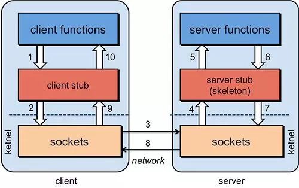
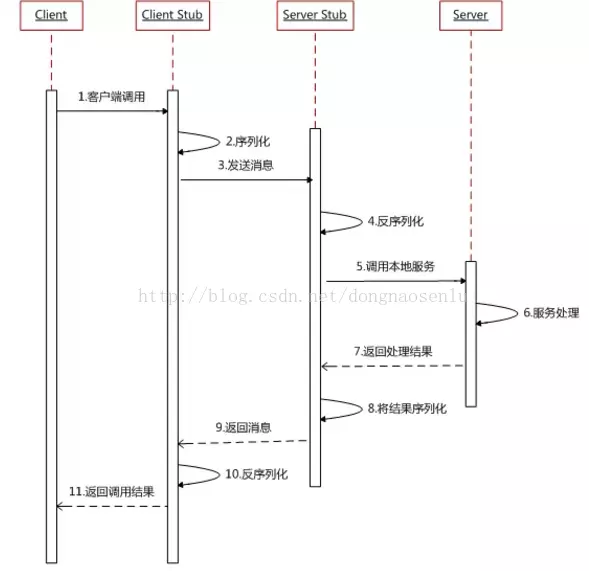
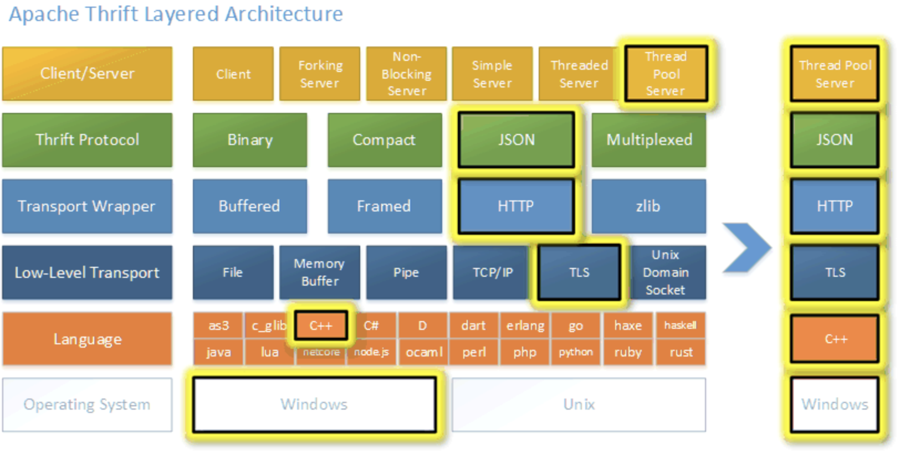
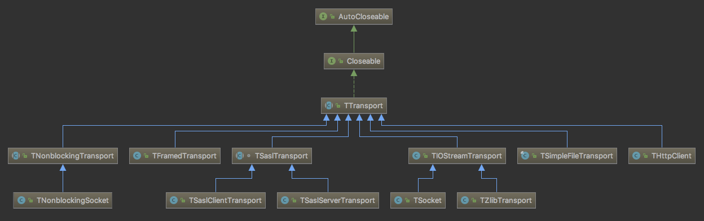
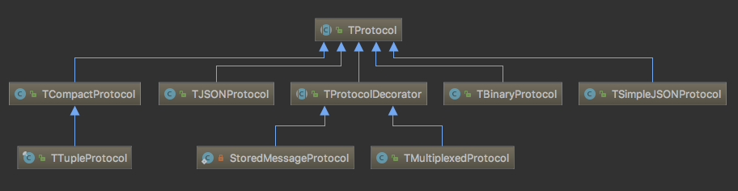
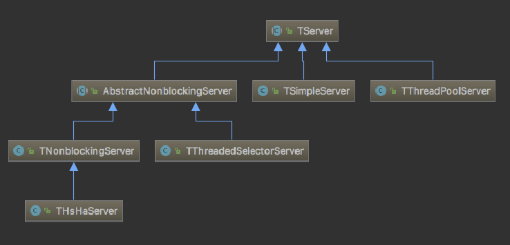
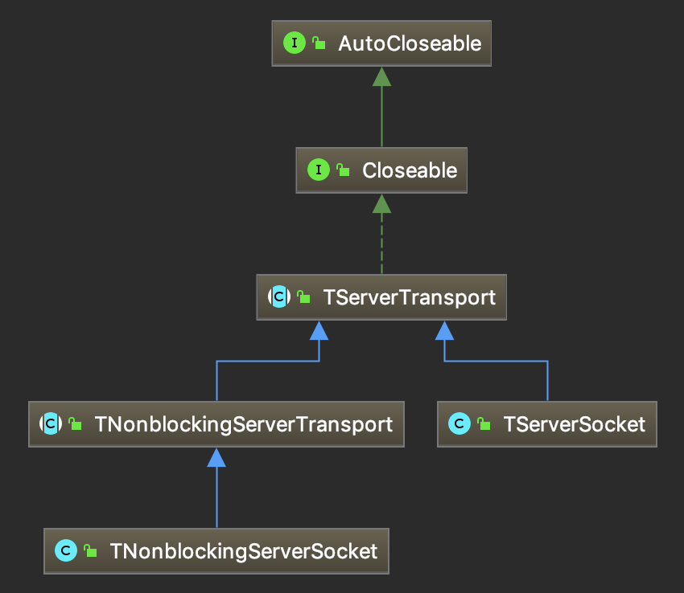

# 什么是微服务？

微服务架构风格是一种将单个应用程序作为一套小型服务开发的方法。

每种应用程序都在自己进程中运行，并与轻量级机制（通常是HTTP资源API）进行通信。

这些服务是围绕业务功能构建的，可以通过自动部署机制独立部署。

这些服务的集中管理最少，可以用不同的编程语言编写，并使用不同的数据存储技术。

微服务架构的系统是一个分布式的系统，按业务进行划分为独立的服务单元，解决单体系统的不足，同时也满足越来越复杂的业务需求。

**微服务的特点？**

1. 独立部署，灵活拓展。

   传统的单体架构是以整个系统为单位进行部署，而微服务则是以一个独立组件（例如用户服务，商品服务）为单位进行部署。

   现在的**<font color='red'>docker</font>**，可以为微服务提供有效容器。

2. 资源的有效隔离

   微服务的设计原则之一，就是每一个微服务拥有独立的数据源，假如微服务A想要读写微服务B的数据库，只能调用微服务B对外暴露的接口来完成。这样有效避免了微服务之间争用数据库和缓存资源所带来的的问题。

   每一个微服务实例在docker上面运行，实现了服务器资源（内存、CPU资源等）的有效隔离。

3. 团队组织架构的调整

   微服务设计的思想改变了原有的企业研发团队组织架构。

   传统的研发组织架构师水平架构，前端有前端的团队，后端有后端的团队，DBA有DBA的团队，测试有测试的团队。

   而微服务的设计思想对团队的划分有一定的影响，使得团队组织架构的划分更倾向于垂直架构，比如用户业务是一个团队来负责，支付业务是一个团队来负责。

**微服务与面向服务架构SOA的区别**

SOA架构是一种粗颗粒、松耦合的服务架构，其更多的是强调异构系统之间的服务通信。

SOA架构强调的是**<font color='red'>异构</font>**系统之间的通信和解耦合，而微服务架构强调的是系统按业务边界做细粒度的拆分和部署。

Bobbo和string cloud 很好地支持了SOA和微服务架构，但不能说Bubbo是SOA，string，cloud是微服务。

**微服务架构的不足**

微服务架构把原有的项目拆成多个独立的工程，增加了开发和测试的复杂度。

微服务架构需要保证不同服务之间的数据一致性，引入了分布式事务和异步补偿机制，为设计和开发带来了一定挑战。

架构设计没有绝对的好坏，关键还是看应用场景。


# RPC简介及框架选择

简单介绍一下RPC协议以及常见的框架，对比传统的**<font color='red'>Restful Api</font>**和RPC方式的优缺点。常见RPC框架，GRPC及序列化方式Protobuf等。

**HTTP协议：**

http协议是基于tcp协议的，tcp协议是流式协议，包头部分可以通过多出的\r\n来分界。

包体部分如何分界呢？

这是协议本身要解决的问题。

目前一般有两种方式，第一种方式就是在包头中有个content-Length字段，这个字段的值的大小标识了POST数据的长度，服务器收到一个数据包后，先从包头解析出这个字段的值，再根据这个值去读取相应长度的作为http协议的包体数据。

浏览器connect 80 端口。

**RESTful API （http + json）**

什么是restful架构：

1. 每一个url代表一种资源；
2. 客户端和服务器之间，传递这种资源的某种表现层，比如用json，xml，jpeg等；
3. 客户端通过四个HTTP动词，对服务端资源进行操作，实现“表现层状态转化”。

url定位资源，用HTTP动词（GET、POST、DELETE、DETC）描述操作。

用HTTP协议里的动词来实现资源的添加，修改，删除等操作。即通过HTTP动词来实现资源的状态扭转：

- GET用来获取资源，
- POST用来新建资源（也可以用来更新资源）

- PUT用来更新资源，
- DELETE用来删除资源。

**RPC**

进程间通信（IPC ， Inter-Process Communication），指至少两个进程或县城间传送数据或信号的一些技术或方法。进程是计算机系统分配资源的最小单位。每个进程都有自己的一部分独立系统资源，彼此是隔离的。为了能使不同的进程互相访问资源并进行协调工作，才有了进程间通信，这些进程可以运行在同一个计算机上或网络连接的不同计算机上，进程间通信技术包括消息传递、同步、共享内存和远程过程调用。IPC是一种标准的Unix通信机制。

有两种类型的进程间通信（IPC）

- 本地过程调用（LPC）LPC用在多任务操作系统中，使得同时运行的任务能互相会话，这些任务共享内存空间使任务同步和互相发发送消息。
- 远程过程调用（RPC）RPC类似于LPC，只是在网上工作。RPC开始是出现在Sum维系统公司和HP公司的运行UNIX操作系统的计算机中。

为什么RPC呢？

就是无法在一个进程内，甚至一个计算机内通过本地调用的方式完成的需求，比如如不同的系统间通讯，甚至不同的组织间通讯，由于计算能力需要横向拓展，需要在多台机器组成的集群上部署应用。

RPC的核心并不在于使用什么协议。RPC的目的是让你在本地调用远程的方法，而对你来说这个调用是透明的，你并不知道这种调用的方法是部署在哪里。通过RPC能够**<font color='red'>解耦</font>**服务，这才是使用RPC的真正目的。RPC的原理主要用到了动态代理模式，至于http协议，只是传输协议而已。简单的实现可以参考spring remoting，复杂的实现可以参考dubbo。


简单的说，

- RPC就是从一台机器（客户端）上通过参数传递的方式调用另一台机器（服务器）上的一个函数或方法（可以统称为服务）并得到返回的结果。
- RPC 会隐藏底层的通讯细节（不需要直接处理Socket通讯或Http通讯） RPC 是一个请求响应模型。
- 客户端发起请求，服务器返回响应（类似于Http的工作方式） RPC 在使用形式上像调用本地函数（或方法）一样去调用远程的函数（或方法）。

**RPC通信过程**

[RPC架构简单理解](https://blog.csdn.net/u013521220/article/details/66530188)
[远程过程调用(RPC)详解](https://waylau.com/remote-procedure-calls/)

默认socket通信。本地机器的RPC框架反序列化出执行结果，函数return这个结果




**RPC和restful api对比**

[* REST vs JSON-RPC? - stackoverflow](https://stackoverflow.com/questions/15056878/rest-vs-json-rpc)
[既然有http 请求，为什么还要用rpc调用？ - 手不要乱摸的回答 - 知乎](https://www.zhihu.com/question/41609070/answer/191965937)
[为什么需要RPC，而不是简单的HTTP接口](https://blog.csdn.net/weixin_42098168/article/details/80365260)

REST是一种设计风格，它的很多思维方式与RPC是完全冲突的。 RPC的思想是把本地函数映射到API，也就是说一个API对应的是一个function，我本地有一个getAllUsers，远程也能通过某种约定的协议来调用这个getAllUsers。至于这个协议是Socket、是HTTP还是别的什么并不重要； RPC中的主体都是动作，是个动词，表示我要做什么。 而REST则不然，它的URL主体是资源，是个名词。而且也仅支持HTTP协议，规定了使用HTTP Method表达本次要做的动作，类型一般也不超过那四五种。这些动作表达了对资源仅有的几种转化方式。
RPC的根本问题是耦合。RPC客户端以多种方式与服务实现紧密耦合，并且很难在不中断客户端的情况下更改服务实现。RPC更偏向内部调用，REST更偏向外部调用。

Web 服务应该算是 RPC 的一个子集，理论上 RPC 能实现的功能， 用 Web 服务也能实现，甚至很多 RPC 框架选用 HTTP 协议作为传输层。
现在很多网站的 API 都是以 HTTP 服务的形式提供的，这也算是 RPC 的一种形式。

区别主要在这 2 个东西设计的出发点不太一样：

- HTTP 是面向浏览器设计的应用层协议，操作的核心在**资源。**我们更多的用 Web 服务在做网站。
- RPC 是为了在像在本地调用一个函数那样调用远程的代码而设计的，所以更关注减少本地调用和远程调用的差异，像 SOAP(简单对象访问协议) 这种东西是可以把对象当参数传的。

我们讨论 RPC 和 Web 的区别，其实是在谈论 2 个东西：序列化协议和传输协议。序列化协议比如常见的 XML，JSON 和比较现代的 Protocol Buffers、Thrift。 传输协议比如 TCP、UDP 以及更高层的 HTTP 1.1、HTTP 2.0。

一般我们考虑用 RPC 而不是 HTTP 构建自己的服务，通常是考虑到下面的因素：

- 接口是否需要 Schema 约束
- 是否需要更高效的传输协议（TCP，HTTP 2.0）
- 是否对数据包的大小非常敏感

比如 HTTP 是基于文本的协议，头部有非常多冗余（对于 RPC 服务而言）。HTTP 中我们用的最多就是 RESTful ，而 RESTful 是个弱 Schema 约束，大家通过文档沟通，但是如果我就是不在实现的时候对接口文档约定的参数做检查，你也不能把我怎么样。这个时候 Thrift 这种序列化协议的优势就体现出来了，由于 Schema 的存在，可以保证服务端接受的参数和 Schema 保持一致。

RPC框架

[谁能用通俗的语言解释一下什么是 RPC 框架？ - 洪春涛的回答 - 知乎](https://www.zhihu.com/question/25536695/answer/221638079)
[常用的跨语言通信方案](https://www.cnblogs.com/doit8791/p/4979465.html)
[深入浅出 RPC - 深入篇](https://blog.csdn.net/mindfloating/article/details/39474123)

- Call ID映射。我们怎么告诉远程机器我们要调用Multiply，而不是Add或者FooBar呢？在本地调用中，函数体是直接通过函数指针来指定的，我们调用Multiply，编译器就自动帮我们调用它相应的函数指针。但是在远程调用中，函数指针是不行的，因为两个进程的地址空间是完全不一样的。所以，在RPC中，所有的函数都必须有自己的一个ID。这个ID在所有进程中都是唯一确定的。客户端在做远程过程调用时，必须附上这个ID。然后我们还需要在客户端和服务端分别维护一个 {函数 <--> Call ID} 的对应表。两者的表不一定需要完全相同，但相同的函数对应的Call ID必须相同。当客户端需要进行远程调用时，它就查一下这个表，找出相应的Call ID，然后把它传给服务端，服务端也通过查表，来确定客户端需要调用的函数，然后执行相应函数的代码。
- 序列化和反序列化。客户端怎么把参数值传给远程的函数呢？在本地调用中，我们只需要把参数压到栈里，然后让函数自己去栈里读就行。但是在远程过程调用时，客户端跟服务端是不同的进程，不能通过内存来传递参数。甚至有时候客户端和服务端使用的都不是同一种语言（比如服务端用C++，客户端用Java或者Python）。这时候就需要客户端把参数先转成一个字节流，传给服务端后，再把字节流转成自己能读取的格式。这个过程叫序列化和反序列化。同理，从服务端返回的值也需要序列化反序列化的过程。
- 网络传输。远程调用往往用在网络上，客户端和服务端是通过网络连接的。所有的数据都需要通过网络传输，因此就需要有一个网络传输层。网络传输层需要把Call ID和序列化后的参数字节流传给服务端，然后再把序列化后的调用结果传回客户端。只要能完成这两者的，都可以作为传输层使用。因此，它所使用的协议其实是不限的，能完成传输就行。尽管大部分RPC框架都使用TCP协议，但其实UDP也可以，而gRPC干脆就用了HTTP2。Java的Netty也属于这层的东西。

目前有很多Java的RPC框架，有基于Json的，有基于XML，也有基于二进制对象的。

论复杂度，RPC框架肯定是高于简单的HTTP接口的。但毋庸置疑，HTTP接口由于受限于HTTP协议，需要带HTTP请求头，导致传输起来效率或者说安全性不如RPC




常用RPC框架

支持Java最多，golang

- Netty - Netty框架不局限于RPC，更多的是作为一种网络协议的实现框架，比如HTTP，由于RPC需要高效的网络通信，就可能选择以Netty作为基础。
- brpc是一个基于protobuf接口的RPC框架，在百度内部称为“baidu-rpc”，它囊括了百度内部所有RPC协议，并支持多种第三方协议，从目前的性能测试数据来看，brpc的性能领跑于其他同类RPC产品。
- Dubbo是Alibaba开发的一个RPC框架，远程接口基于Java Interface, 依托于Spring框架。
- gRPC的Java实现的底层网络库是基于Netty开发而来，其Go实现是基于net库。
- Thrift是Apache的一个项目([http://thrift.apache.org](http://thrift.apache.org/))，前身是Facebook开发的一个RPC框架，采用thrift作为IDL (Interface description language)。
- jsonrpc

JSON-RPC

[python web接口实现（restful方式、jsonrpc方式）](https://www.jianshu.com/p/545acae57e27)
区块链项目中用的较多？资料不是很多
JSON-RPC是一种序列化协议。JSON 是 JS 对象的字符串表示法，它使用文本表示一个 JS 对象的信息，本质是一个字符串。
非常简单，方便，速度慢
相关Python 包(直接集成到flask和django)
Flask-JSONRPC,django-json-rpc；jsonrpcserver,jsonrpcclient

thrift

[Python RPC 之 Thrift](https://www.jianshu.com/p/82a6bdaabcd3)
Facebook开源的跨语言RPC框架。

gRPC

[gRPC 官方文档中文版](http://doc.oschina.net/grpc?t=56831)
[深入了解gRPC协议-知乎](https://zhuanlan.zhihu.com/p/27595419)

1. tensorflow分布式与tensorflow serving底层通信都是是用的grpc
   序列化用protobuf，通信使用http2
2. latest Google APIs will have gRPC versions of their interfaces, letting you easily build Google functionality into your applications.
3. 支持 C, C++, Node.js, Python, Ruby, Objective-C,PHP and C#

HTTP2

[一文读懂 HTTP2 特性 - 又拍云的文章 - 知乎](https://zhuanlan.zhihu.com/p/26559480)
[HTTP/2 和 HTTP/1 速度对比](https://link.zhihu.com/?target=https%3A//http2.akamai.com/demo)
http://www.http2demo.io/
[HTTP/2](https://hpbn.co/http2/)
HTTP/2 是 HTTP 协议自 1999 年 HTTP 1.1 发布后的首个更新，主要基于 SPDY 协议。
HTTP/2的主要目标是通过启用完整请求和响应复用来减少延迟，通过有效压缩HTTP头字段来最大限度地降低协议开销，并添加对请求优先级和服务器推送的支持;多路复用(同一tcp,多个流)，头部压缩，服务推送。

Protobuf

[常用的跨语言通信方案](https://www.cnblogs.com/doit8791/p/4979465.html)
[Google Protocol Buffer 的使用和原理](https://www.ibm.com/developerworks/cn/linux/l-cn-gpb/index.html)
[Protobuf 语法指南](http://colobu.com/2015/01/07/Protobuf-language-guide/)
Protocol Buffers 是一种轻便高效的结构化数据存储格式，可以用于结构化数据串行化，或者说序列化。它很适合做数据存储或 RPC 数据交换格式。可用于通讯协议、数据存储等领域的语言无关、平台无关、可扩展的序列化结构数据格式。目前提供了 C++、Java、Python 三种语言的 API。
同 XML 相比， Protobuf 的主要优点在于性能高。它以高效的二进制方式存储，比 XML 小 3 到 10 倍，快 20 到 100 倍。

框架选择

[gRPC vs Thrift](https://blog.csdn.net/dazheng/article/details/48830511)
[RPC框架性能基本比较测试](http://www.useopen.net/blog/2015/rpc-performance.html)
[怎么看待谷歌的开源 RPC 框架 gRPC？ - 知乎](https://www.zhihu.com/question/30027669)
[微服务的服务间通信与服务治理](https://zhuanlan.zhihu.com/p/35427150)
[最佳实践 | 7大维度看国外企业为啥选择gRPC打造高性能微服务？](https://zhuanlan.zhihu.com/p/33623693)

如何选择

**什么时候应该选择gRPC而不是Thrift**

　　需要良好的文档、示例
　　喜欢、习惯HTTP/2、ProtoBuf
　　对网络传输带宽敏感
**什么时候应该选择Thrift而不是gRPC**
　　需要在非常多的语言间进行数据交换
　　对CPU敏感
　　协议层、传输层有多种控制要求
　　需要稳定的版本
　　不需要良好的文档和示例

总的来说，Python rpc框架选择较少，thrift性能最好，grpc性能比thrift稍差，原因是多了http2，而thrift直接基于tcp，但grpc序列化方案更通用(protobuf)优秀，文档较好；
jsonrpc 本身基于http/1进行通信，速度最慢，相对于之前速度无提升，只是接口和数据格式更为统一；

**gRPC不足**

1）GRPC尚未提供连接池
2）尚未提供“服务发现”、“负载均衡”机制
3）因为基于HTTP2，绝大部多数HTTP Server、Nginx都尚不支持，即Nginx不能将GRPC请求作为HTTP请求来负载均衡，而是作为普通的TCP请求。（nginx将会在1.9版本支持）


# 为什么使用Thrift RPC框架？

**Thrift 有什么特点？**

1. 基于二进制的高性能的编解码框架
2. 基于NIO的底层通信
3. 相对简单的服务调用模型
4. 使用IDL支持跨平台调用

**Thrift 的整体架构？**



官方文档 [Apache Thrift - Concepts](https://thrift.apache.org/docs/concepts)详细说明了Thrift的架构：

**Thrift network stack**

```java
  +-------------------------------------------+
  | Server                                    |
  | (single-threaded, event-driven etc)       |
  +-------------------------------------------+
  | Processor                                 |
  | (compiler generated)                      |
  +-------------------------------------------+
  | Protocol                                  |
  | (JSON, compact etc)                       |
  +-------------------------------------------+
  | Transport                                 |
  | (raw TCP, HTTP etc)                       |
  +-------------------------------------------+
```

**Transport**

`Transport layer`提供了一个从网络IO读写的简单抽象，可以使Thrift与底层解耦。

Transport接口有：

- open
- close
- read
- write
- flush

除了Transport接口，还有一个`ServerTransport`，用来在server端创建请求的连接。

- open
- listen
- accept
- close

**Protocol**

`Protocol`定义了传输数据的序列化、反序列化机制（JSON、XML、binary、compact binary等）。

Protocol的接口如下：

```java
writeMessageBegin(name, type, seq)
writeMessageEnd()
writeStructBegin(name)
writeStructEnd()
writeFieldBegin(name, type, id)
writeFieldEnd()
writeFieldStop()
writeMapBegin(ktype, vtype, size)
writeMapEnd()
writeListBegin(etype, size)
writeListEnd()
writeSetBegin(etype, size)
writeSetEnd()
writeBool(bool)
writeByte(byte)
writeI16(i16)
writeI32(i32)
writeI64(i64)
writeDouble(double)
writeString(string)

name, type, seq = readMessageBegin()
                  readMessageEnd()
name = readStructBegin()
       readStructEnd()
name, type, id = readFieldBegin()
                 readFieldEnd()
k, v, size = readMapBegin()
             readMapEnd()
etype, size = readListBegin()
              readListEnd()
etype, size = readSetBegin()
              readSetEnd()
bool = readBool()
byte = readByte()
i16 = readI16()
i32 = readI32()
i64 = readI64()
double = readDouble()
string = readString()
```

**Processor**

`Processor`封装了读取输入流、写入输出流的能力，其中输入流、输出流都是`Protocol`的对象。接口很简单：

```java
interface TProcessor {
    bool process(TProtocol in, TProtocol out) throws TException
}
```

其中用户需要实现TProcessor接口。

# Thrift 的源码实现？

**TTransport**



TTransport有很多实现，其中最重要的就是TFramedTransport。

客户端的实际使用：

```java
TSocket socket = new TSocket(host, port);
socket.setTimeout(timeout);
TTransport transport = new TFramedTransport(socket);
TProtocol protocol = new TCompactProtocol(transport);
transport.open();
```

**TProtocol**



Thrift主要支持的协议有：

- JSON
- SimpleJSON
- Binary
- Compact Binary

其中`Binary`协议的序列化、反序列化，可以参考我的另一篇文章：[Thrift 对象序列化、反序列化-字节数组分析](https://www.jianshu.com/p/1b322180d011)。

**TServer**



解释起来太麻烦，还是直接贴思维导图吧，更直观 0_o


**TServerTransport**

TServerTransport作为服务器的Acceptor抽象，来监听端口，创建客户端Socket连接。



- TNonblockingServerTransport和TNonblockingServerSocket作为非阻塞IO的Acceptor,封装了ServerSocketChannel
- TServerSocket作为阻塞同步IO的Acceptor，封装了ServerSocket

# 其他 RPC 框架有哪些？

- rpcx: 基于Go的服务治理的rpc框架、客户端支持跨语言
- grpc: Google 出品的跨语言rpc框架，很弱的(实验性的)负载均衡, 测试使用的是grpc-go
- go std rpc: Go标准库的rpc, 不支持跨语言(jsonrpc支持json rpc 1.0)
- thrift: 跨语言的rpc框架，facebook贡献
- dubbo: 国内较早开源的服务治理的Java rpc框架，虽然在阿里巴巴内部竞争中落败于HSF，沉寂了几年，但是在国内得到了广泛的应用，目前dubbo项目又获得了支持，并且dubbo 3.0也开始开发
- motan: 微博内部使用的rpc框架，底层支持java,生态圈往service mesh发展以支持多语言
- hprose: 国内开发人员开发的一个跨语言的rpc框架，非服务治理但是性能高效
- twirp: twitch.tv刚刚开源的一个restful风格的rpc框架
- go-micro: Go语言的一个服务治理rpc框架， 在测试中发现性能不太好，所以没有继续测试，相关的测试代码已在github库中
- go kit:
- 腾讯 Tars:腾讯公司的rpc框架
- 百度 brpc: 百度公司的rpc框架
- spring cloud:

参考自：[流行的rpc框架benchmark 2018新春版](https://colobu.com/2018/01/31/benchmark-2018-spring-of-popular-rpc-frameworks/)。

# 为什么不使用Dubbo?

因为我们是python开发！

**<font color='red'></font>**