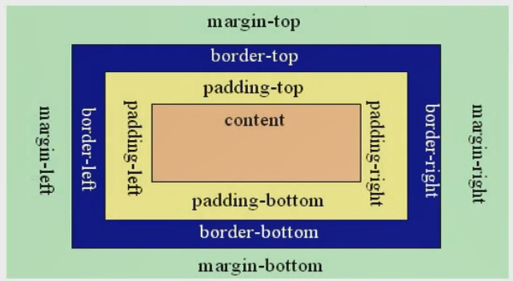

# CSS盒子模型

## 盒子模型解释

元素在页面中显示成一个方块，类似一个盒子，CSS盒子模型就是使用实现中盒子来做比喻，帮助我们设置元素对应的样式。盒子模型示意图如下：



把元素叫做盒子，设置对应的样式分别为：

- 盒子的宽度（width）
- 盒子的高度（height）
- 盒子的边框（border）
- 盒子内的内容和边框之间的间距（padding）
- 盒子与盒子之间的距离（margin）

## 设置高度

```html
width:200px; /*设置盒子的宽度，此宽度是指盒子内容的宽度，不是盒子整体宽度（难点）*/
height:200px；/*设置盒子的高度，此高度是指盒子内容的高度，不是盒子整体高度（难点）*/
```

## 设置边框

设置一个边框，比如顶部边框，可以按如下设置：

```html
border-top-color:red; /*设置顶部边框颜色为红色*/
border-top-width:10px;   /*设置顶部边框粗细为10px*/
border-top-style:solid;   /*设置顶部边框的线性为实线，常用的有：solid(实线)，
																													dashed(虚线)，
																													dotted（点线）。*/
```

**上面三局可以简写成一句：**

```html
border:10px solid red ;
```

设置其他三个边的方法和上面一样，把上面的  top  换成 left 就是左边 ，换成 right就是右边 ，换成 bottom 就是 底边 。

四个边如果设置都一样，可以将四个边的设置合并成一句：

```html
border : 10px solid red ;
```

## 设置内间距 padding

设置盒子四边的内间距，可以设置如下：

```html
padding - top :20px ;    /设置底部内间距20px*/
padding - left :30px ;    /*设置左边内边距30px*/
padding - right :40px ;   /*设置右边内边距40px*/
padding - bottom :50px ;   /*设置底部内边距50px*/
```

**上面的设置可以简写如下：**

```html
padding :20px 40px 50px 30px ; /*四个值按照顺时针的方向，分别设置是
																上 右 下 左 四个方向的内边距值*/
```

## 设置外间距 margin

外边距的设置方法和 padding 的设置方法相同，将上面设置项中的 padding 换成 margin 就是外边距设置方法。


# 盒子模型的实际尺寸

```html
<!DOCTYPE html>
<html>
<head>
	<meta charset="utf-8">
	<title>盒子的真是尺寸</title>
	<style type="text/css">
		.box01{
			width: 50px;
			height:50px;
			background-color:gold;
		}
		.box02{
			width: 50px;
			height: 50px;
			background-color: gold;
			border:50px solid #000
		}
		.box03{
			width: 50px;
			height: 50px;
			background-color: gold;
			border:50px solid #000;
			padding: 50px;
		}
	</style>
</head>
<body>
	<div class="box01">01</div>
	<div class="box02">02</div>
	<div class="box03">03</div>

</body>
</html>

```

# 盒子模型使用技巧及相关问题

## margin 相关技巧

1. 设置元素水平居中 ： margin : 0 auto;
2. margin 负值让元素位移及边框合并

## 外边距合并

外边距合并指的是 当两个垂直外边距相遇时 ，他们讲形成一个外边距。合并后的外边距的高度等于两个发生合并的外边距的高度相当于较大者。解决方法如下：

1. 使用这种特性。
2. 设置一遍的外边距，一般设置margin - top 
3. 将元素设置浮动或者定位

## margin - top 塌陷

在两个盒子嵌套时候，内部的盒子设置 margin - top 回家到外边的盒子上，导致内部的盒子 margin - top 设置失败，解决方法如下：

1. 外部盒子设置一个边框。

2. 外部盒子设置 overflow : hidden

3. 使用伪类元素：

   ```html
   .clearfix:before{
   			content:"";
   			display:table;
   			}
   ```

### 方法实战

```html
<!DOCTYPE html>
<html>
<head>
	<title>margin - top 塌陷</title>
	<style type="text/css">

		/*第三种解决方法*/
		.clearfix:before{
			content:"";
			display:table;
			}

		.con{
			width: 300px;
			height: 300px;
			background-color: gold;

			/*第一种解决塌陷的方法*/
			/*border : 1px solid #000;*/

			/*第二种解决塌陷的方法*/
			/*overflow: hidden;*/

		}
		.box{
			width: 200px;
			height: 100px;
			background-color: green;
			margin-top: 100px;
			margin-left: 50px;
		}
	</style>
</head>
<body>
	<div class="con clearfix">
		<div class="box"></div>
	</div>
	

</body>
</html>
```


## CSS元素溢出

当子元素的尺寸超过父元素的尺寸时，需要设置父元素显示溢出的子元素的方式，设置的方法是通过overflow属性来设置。

**overflow 的设置项：**

1. visible 默认值。内容不会被修剪，会呈现在元素框之外。
2. hidden 内容会被修剪，并且其余内容是不可见的，次属性还有清除浮动、清除 margin - top 塌陷的功能。
3. scroll 内容会被修剪，但是浏览器会显示滚动条以便查看其余的内容。
4. auto 如果内容被修剪，则浏览器会显示滚动条以便查看其余内容。
5. inherit 规定应该从父元素继承 overflow 属性的值。


