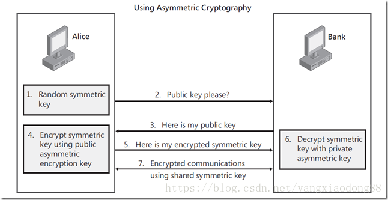

# python 各种加密

# 背景

加密学习 
**对称加密** 
对称密钥加密 ， 又叫私钥加密。即信息发送的方和接受方用一个密钥去加密和揭秘数据。 最大的优势是 加解密速度快，适合对大量数据进行加密， 对称加密的缺点是密钥的管理和分配， 换句话说就是 如何把密钥发送到需要解密你的消息的人手里的问题。在发送密钥的过程中， 密钥有很大的风险被黑客拦截。 现实中的做法是将对称加密的密钥进行非对称加密然后传给需要他的人。 
**非对称加密** 
非对称加密系统， 又称公钥密钥加密。 非对称加密为数据的加密与解密提供了一种非常安全的方式。她使用了一对密钥， 私钥和公钥。 私钥只能有一方安全保管， 不能外泄， 而公钥可以发给任何请求她的人。非对称加密使用这对密钥中的一个进行加密， 而解密却需要一个另外一个密钥。 比如你去银行 你向银行请求公钥，银行将公钥发给你，你使用公钥对消息加密，那么只有私钥的持有人–银行才能对你的消息解密。 与对称加密的不同之处是， 银行不需要将私钥通过网络发送出去。因此安全性大大提高。 目前最常用的非对称加密算法是RSA算法。公钥机制灵活，但加密和解密速度却比对称密钥加密慢得多。 公钥机制灵活， 但是加密和解密速度却要比堆成加密慢很多。 
1） Alice需要在银行的网站做一笔交易，她的浏览器首先生成了一个随机数作为对称密钥。 
（2） Alice的浏览器向银行的网站请求公钥。 
（3） 银行将公钥发送给Alice。 
（4） Alice的浏览器使用银行的公钥将自己的对称密钥加密。 
（5） Alice的浏览器将加密后的对称密钥发送给银行。 
（6） 银行使用私钥解密得到Alice浏览器的对称密钥。 
（7） Alice与银行可以使用对称密钥来对沟通的内容进行加密与解密了。 




（三）总结 
（1） 对称加密加密与解密使用的是同样的密钥，所以速度快，但由于需要将密钥在网络传输，所以安全性不高。 
（2） 非对称加密使用了一对密钥，公钥与私钥，所以安全性高，但加密与解密速度慢。 
（3） 解决的办法是将对称加密的密钥使用非对称加密的公钥进行加密，然后发送出去，接收方使用私钥进行解密得到对称加密的密钥，然后双方可以使用对称加密来进行沟通。

## base64 加密

python3 输入的都是 二进制 byte类型 
**注意：用于base64编码的，要么是ASCII包含的字符，要么是二进制数据** 
base64 是对称加密

base64 的加密和解密

```
import base64

s = 'hello, world'
s = "你好"
# 加密
bs = base64.b64encode(s.encode("utf8"))
print(bs)

# 解密
decode = base64.b64decode(bs)
print(decode)
print(decode.decode("utf8"))
```

base64 是 一种用64 个字符来表示任意的二进制数据的方法。base64 可以成为密码学的基石。可以将任意二进制数据进行Base64 编码。 所有的数据都能被编码为并只有64个字符就能表示的文本文件。（ 64字符：A~Z a~z 0~9 + / ）编码后的数据~=编码前数据的4/3，会大1/3左右。

Base64编码的原理 


1 将所有字符转化为ASCII码。 
2 将ASCII码转化为8位二进制 。 
3 将二进制3个归成一组(不足3个在后边补0)共24位，再拆分成4组，每组6位。 
4 统一在6位二进制前补两个0凑足8位。 
5 将补0后的二进制转为十进制。 
6 从Base64编码表获取十进制对应的Base64编码。

**Base64编码的说明**

1 转换的时候，将三个byte的数据，先后放入一个24bit的缓冲区中，先来的byte占高位。 
2 数据不足3byte的话，于缓冲区中剩下的bit用0补足。然后，每次取出6个bit，按照其值选择查表选择对应的字符作为编码后的输出。 
3 不断进行，直到全部输入数据转换完成。 
4 如果最后剩下两个输入数据，在编码结果后加1个“=”。 
5 如果最后剩下一个输入数据，编码结果后加2个“=”。 
6 如果没有剩下任何数据，就什么都不要加，这样才可以保证资料还原的正确性。

## MD5

由于MD5模块在python3中被移除，在python3中使用hashlib模块进行md5操作

```
import hashlib

str = "我真帅"

# 创建一个md5 对象
h1 = hashlib.md5()
# 此处必须声明encode
# 若写法为hl.update(str)  报错为： Unicode-objects must be encoded before hashing
h1.update(str.encode())
print("加密前", str)
print("加密后", h1.hexdigest())
```

## sha1 加密

```
import hashlib
def str_encrypt(str):
    """
    使用sha1加密算法，返回str加密后的字符串
    """
    sha = hashlib.sha1(str)
    encrypts = sha.hexdigest()
    return encrypts
```


**简介** 
message-digest algorithm 5（信息-摘要算法）。经常说的“MD5加密”，就是它→信息-摘要算法。

md5，其实就是一种算法。可以将一个字符串，或文件，或压缩包，执行md5后，就可以生成一个固定长度为128bit的串。这个串，基本上是唯一的。

**不可逆性** 
每个人都有不同的指纹，看到这个人，可以得出他的指纹等信息，并且唯一对应，但你只看一个指纹，是不可能看到或读到这个人的长相或身份等信息。

**特点**

1 压缩性：任意长度的数据，算出的MD5值长度都是固定的。 
2 容易计算：从原数据计算出MD5值很容易。 
3 抗修改性：对原数据进行任何改动，哪怕只修改1个字节，所得到的MD5值都有很大区别。 
4 强抗碰撞：已知原数据和其MD5值，想找到一个具有相同MD5值的数据（即伪造数据）是非常困难的。

**MD5长度**

md5的长度，默认为128bit，也就是128个0和1的二进制串。这样表达是很不友好的。所以将二进制转成了16进制，每4个bit表示一个16进制，所以128/4 = 32 换成16进制表示后，为32位了。

为什么网上还有md5是16位的呢？

其实16位的长度，是从32位md5值来的。是将32位md5去掉前八位，去掉后八位得到的。

**DES**

Python加密库PyCryptodome 
PyCrytodome 取代了 PyCrypto 。 
安装与导入 
Windows安装之前需要先安装Microsoft Visual c++ 2015。

下载地址：<https://www.microsoft.com/en-us/download/details.aspx?id=48145>

在Linux上安装，可以使用以下 pip 命令： 
pip install pycryptodome 
import Crypto

在Windows 系统上安装则稍有不同： 
pip install pycryptodomex 
import Cryptodome

DES算法为密码体制中的对称密码体制，又被称为美国数据加密标准。

DES是一个分组加密算法，典型的DES以64位为分组对数据加密，加密和解密用的是同一个算法。

DES算法的入口参数有三个：Key、Data、Mode。其中Key为7个字节共56位，是DES算法的工作密钥；Data为8个字节64位，是要被加密或被解密的数据；Mode为DES的工作方式,有两种:加密或解密。

密钥长64位，密钥事实上是56位参与DES运算（第8、16、24、32、40、48、56、64位是校验位，使得每个密钥都有奇数个1），分组后的明文组和56位的密钥按位替代或交换的方法形成密文组。

**加密原理** 
DES 使用一个 56 位的密钥以及附加的 8 位奇偶校验位，产生最大 64 位的分组大小。这是一个迭代的分组密码，使用称为 Feistel 的技术，其中将加密的文本块分成两半。使用子密钥对其中一半应用循环功能，然后将输出与另一半进行“异或”运算；接着交换这两半，这一过程会继续下去，但最后一个循环不交换。DES 使用 16 个循环，使用异或，置换，代换，移位操作四种基本运算。

**算法步骤** 
1）初始置换 
其功能是把输入的64位数据块按位重新组合,并把输出分为L0、R0两部分,每部分各长3 2位,其置换规则为将输入的第58位换到第一位,第50位换到第2位……依此类推,最后一位是原来的第7位。L0、R0则是换位输出后的两部分，L0是输出的左32位,R0是右32位,例:设置换前的输入值为D1D2D3……D64,则经过初始置换后的结果为:L0=D58D50……D8;R0=D57D49……D7。 
其置换规则见下表： 
58,50,42,34,26,18,10,2,60,52,44,36,28,20,12,4, 
62,54,46,38,30,22,14,6,64,56,48,40,32,24,16,8, 
57,49,41,33,25,17,9,1,59,51,43,35,27,19,11,3, 
61,53,45,37,29,21,13,5,63,55,47,39,31,23,15,7, 
2）逆置换 
经过16次迭代运算后,得到L16、R16,将此作为输入,进行逆置换,逆置换正好是初始置换的逆运算，由此即得到密文输出。 
此算法是对称加密算法体系中的代表,在计算机网络系统中广泛使用.

加密和解密的过程

```
from Cryptodome.Cipher import DES


key = b'abcdefgh'  # 密钥 8位或16位,必须为bytes
def pad(text):
    """
    # 加密函数，如果text不是8的倍数【加密文本text必须为8的倍数！】，那就补足为8的倍数
    :param text:
    :return:
    """
    while len(text) % 8 != 0:
        text += ' '
    return text


des = DES.new(key, DES.MODE_ECB)  # 创建一个DES实例
text = 'Python rocks!'
padded_text = pad(text)
encrypted_text = des.encrypt(padded_text.encode('utf-8'))  # 加密
print(encrypted_text)
# rstrip(' ')返回从字符串末尾删除所有字符串的字符串(默认空白字符)的副本
plain_text = des.decrypt(encrypted_text).decode().rstrip(' ')  # 解密
print(plain_text)
```

```
from Cryptodome.Cipher import DES
import binascii

# 这是密钥
key = b'abcdefgh'
# 需要去生成一个DES对象
des = DES.new(key, DES.MODE_ECB)
# 需要加密的数据
text = 'python spider!'
text = text + (8 - (len(text) % 8)) * '='
# 加密的过程
encrypto_text = des.encrypt(text.encode())
# 加密过后二进制转化为ASCII 
encrypto_text = binascii.b2a_hex(encrypto_text)
print(encrypto_text)
# 解密需要ASCII 先转化为二进制 然后再进行解密
plaint = des.decrypt(binascii.a2b_hex(encrypto_text))
print(plaint)
```

**3DES** 
简介

3DES（或称为Triple DES）是三重数据加密算法（TDEA，Triple Data Encryption Algorithm）块密码的通称。它相当于是对每个数据块应用三次DES加密算法。

由于计算机运算能力的增强，原版DES密码的密钥长度变得容易被暴力破解。3DES即是设计用来提供一种相对简单的方法，即通过增加DES的密钥长度来避免类似的攻击，而不是设计一种全新的块密码算法。

3DES（即Triple DES）是DES向AES过渡的加密算法（1999年，NIST将3-DES指定为过渡的加密标准），加密算法，其具体实现如下：设Ek()和Dk()代表DES算法的加密和解密过程，K代表DES算法使用的密钥，M代表明文，C代表密文，这样：

3DES加密过程为：C=Ek3(Dk2(Ek1(M)))

3DES解密过程为：M=Dk1(EK2(Dk3(C)))

**AES** 
**简介**

高级加密标准（英语：Advanced Encryption Standard，缩写：AES），在密码学中又称Rijndael加密法，是美国联邦政府采用的一种区块加密标准。这个标准用来替代原先的DES，已经被多方分析且广为全世界所使用。经过五年的甄选流程，高级加密标准由美国国家标准与技术研究院（NIST）于2001年11月26日发布于FIPS PUB 197，并在2002年5月26日成为有效的标准。2006年，高级加密标准已然成为对称密钥加密中最流行的算法之一。

AES在软件及硬件上都能快速地加解密，相对来说较易于实作，且只需要很少的存储器。作为一个新的加密标准，目前正被部署应用到更广大的范围。 
特点与思想

```
抵抗所有已知的攻击。
在多个平台上速度快，编码紧凑。
设计简单。
```


AES为分组密码，分组密码也就是把明文分成一组一组的，每组长度相等，每次加密一组数据，直到加密完整个明文。在AES标准规范中，分组长度只能是128位，也就是说，每个分组为16个字节（每个字节8位）。密钥的长度可以使用128位、192位或256位。密钥的长度不同，推荐加密轮数也不同。

一般常用的是128位

```
from Cryptodome.Cipher import AES
from Cryptodome import Random

from binascii import a2b_hex

# 要加密的明文
data = '南来北往'
# 密钥key必须为 16（AES-128）， 24（AES-192）， 32（AES-256）
key = b'this is a 16 key'
# 生成长度等于AES 块大小的不可重复的密钥向量
iv = Random.new().read(AES.block_size)
print(iv)
# 使用 key 和iv 初始化AES 对象， 使用MODE_CFB模式
mycipher = AES.new(key, AES.MODE_CFB, iv)
print(mycipher)
# 加密的明文长度必须为16的倍数， 如果长度不为16的倍数， 则需要补足为16的倍数
# 将iv(密钥向量)加到加密的密钥开头， 一起传输
ciptext = iv + mycipher.encrypt(data.encode())
# 解密的话需要用key 和iv 生成的AES对象
print(ciptext)
mydecrypt = AES.new(key, AES.MODE_CFB, ciptext[:16])
# 使用新生成的AES 对象， 将加密的密钥解密
decrytext = mydecrypt.decrypt(ciptext[16:])

print(decrytext.decode())

```

## RSA

非对称加密 
典型的非对称加密 
典型的如RSA等，常见方法，使用openssl ,keytools等工具生成一对公私钥对，使用被公钥加密的数据可以使用私钥来解密，反之亦然（被私钥加密的数据也可以被公钥解密) 。

在实际使用中私钥一般保存在发布者手中，是私有的不对外公开的，只将公钥对外公布，就能实现只有私钥的持有者才能将数据解密的方法。 这种加密方式安全系数很高，因为它不用将解密的密钥进行传递，从而没有密钥在传递过程中被截获的风险，而破解密文几乎又是不可能的。

但是算法的效率低，所以常用于很重要数据的加密，常和对称配合使用，使用非对称加密的密钥去加密对称加密的密钥。

**简介** 
RSA加密算法是一种非对称加密算法。在公开密钥加密和电子商业中RSA被广泛使用。

该算法基于一个十分简单的数论事实：将两个大素数相乘十分容易，但那时想要对其乘积进行因式分解却极其困难，因此可以将乘积公开作为加密密钥，即公钥，而两个大素数组合成私钥。公钥是可发布的供任何人使用，私钥则为自己所有，供解密之用

而且，因为RSA加密算法的特性，RSA的公钥私钥都是10进制的，但公钥的值常常保存为16进制的格式，所以需要将其用int()方法转换为10进制格式。


```
import rsa


# rsa加密
def rsaEncrypt(str):
    # 生成公钥、私钥
    (pubkey, privkey) = rsa.newkeys(512)
    print("pub: ", pubkey)
    print("priv: ", privkey)
    # 明文编码格式
    content = str.encode('utf-8')
    # 公钥加密
    crypto = rsa.encrypt(content, pubkey)
    return (crypto, privkey)


# rsa解密
def rsaDecrypt(str, pk):
    # 私钥解密
    content = rsa.decrypt(str, pk)
    con = content.decode('utf-8')
    return con


(a, b) = rsaEncrypt("hello")
print('加密后密文：')
print(a)
content = rsaDecrypt(a, b)
print('解密后明文：')
print(content)  
```


```
import rsa
import binascii

def rsa_encrypt(rsa_n, rsa_e, message):
    key = rsa.PublicKey(rsa_n, rsa_e)
    message = rsa.encrypt(message.encode(), key)
    message = binascii.b2a_hex(message)
    return message.decode()


pubkey_n = '8d7e6949d411ce14d7d233d7160f5b2cc753930caba4d5ad24f923a505253b9c39b09a059732250e56c594d735077cfcb0c3508e9f544f101bdf7e97fe1b0d97f273468264b8b24caaa2a90cd9708a417c51cf8ba35444d37c514a0490441a773ccb121034f29748763c6c4f76eb0303559c57071fd89234d140c8bb965f9725'
pubkey_e = '10001'
rsa_n = int(pubkey_n, 16)
rsa_e = int(pubkey_e, 16)
message = '南北今天很忙'
print("公钥n值长度：", len(pubkey_n))

aa = rsa_encrypt(rsa_n, rsa_e, message)
print(aa)


```

```

'''

RSA算法

'''

from Cryptodome.PublicKey import RSA

from Cryptodome.Cipher import PKCS1_OAEP, PKCS1_v1_5


class MyRSA():
    def create_rsa_key(self, password):
        """

        创建RSA密钥

        步骤说明：

        1、从 Crypto.PublicKey 包中导入 RSA，创建一个密码

        2、生成 1024/2048 位的 RSA 密钥

        3、调用 RSA 密钥实例的 exportKey 方法，传入密码、使用的 PKCS 标准以及加密方案这三个参数。

        4、将私钥写入磁盘的文件。

        5、使用方法链调用 publickey 和 exportKey 方法生成公钥，写入磁盘上的文件。

        """

        key = RSA.generate(1024)

        encrypted_key = key.exportKey(passphrase=password.encode("utf-8"), pkcs=8,

                                      protection="scryptAndAES128-CBC")

        with open("my_private_rsa_key.bin", "wb") as f:
            f.write(encrypted_key)

        with open("my_rsa_public.pem", "wb") as f:
            f.write(key.publickey().exportKey())

    def encrypt(self, plaintext):
        # 加载公钥

        recipient_key = RSA.import_key(

            open("my_rsa_public.pem").read()

        )

        cipher_rsa = PKCS1_v1_5.new(recipient_key)

        en_data = cipher_rsa.encrypt(plaintext.encode("utf-8"))

        return en_data

        # print(len(en_data), en_data)

    def decrypt(self, en_data, password):
        # 读取密钥

        private_key = RSA.import_key(

            open("my_private_rsa_key.bin").read(),

            passphrase=password

        )

        cipher_rsa = PKCS1_v1_5.new(private_key)

        data = cipher_rsa.decrypt(en_data, None)

        return data

        # print(data)


mrsa = MyRSA()

mrsa.create_rsa_key('123456')

e = mrsa.encrypt('hello')

d = mrsa.decrypt(e, '123456')

print(e)

print(d)

```


不错网站  <https://blog.csdn.net/cuick2013/article/details/52539555> 