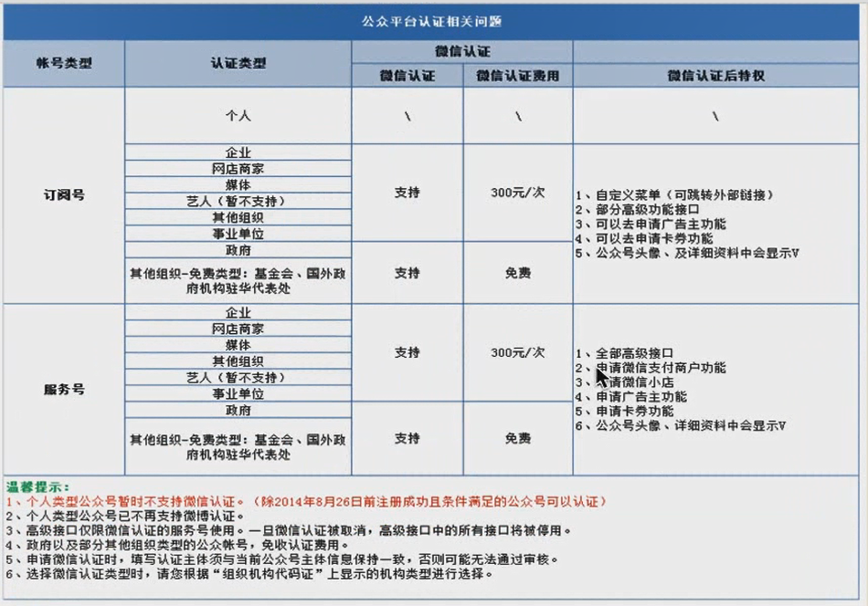
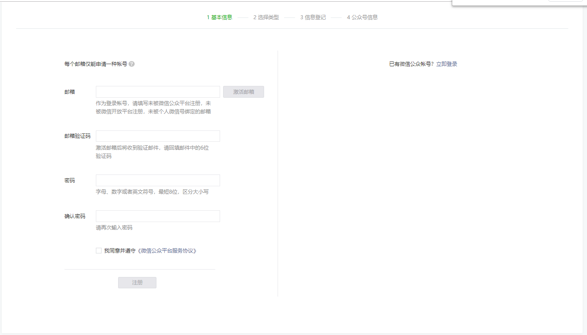
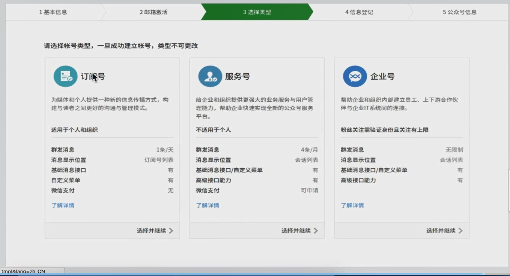
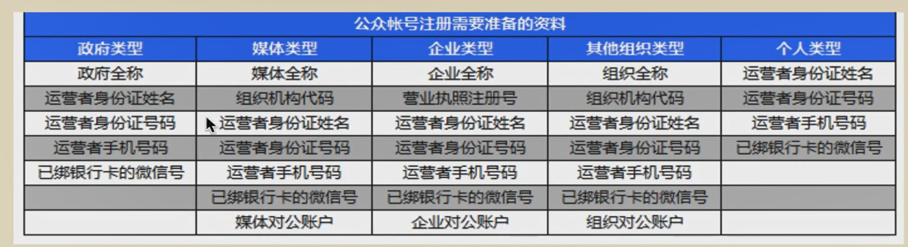

# 一.公众号与公众平台

## 1.微信账号类型

- 个人号
- 公众号
  - 订阅号
  - 服务号
- 企业号

## 二.公众号

微信公众号主要面向名人、政府、媒体、企业等机构推出的合作推广业务。在这里可以通过微信渠道将品牌推广给上亿的微信用户，减少宣传成本，提高品牌知名度，打造更具影响力的品牌形象。

## 三.公众平台

微信公众平台是运营者通过公众号为微信用户提供咨询和服务的平台，而公共平台开发接口则是提供服务的基础，开发者在公众网站中创建公众号，获取接口权限后，可以通过阅读公众平台开发接口文档来帮助开发。

微信公众平台可以用来注册、管理公众号和企业号。

登录网址http://mp.weixin.qq.com/

## 四.公众号与个人号的区别

微信公众号和个人号是完全不相同的。

微信对个人号的定位是普通用户之间的交流和通讯，微信并不鼓励和支持个人使用个人号进行营销推广(微信曾经大规模封杀好友过多的营销个人号)。

而公众号则完全是为了品牌推广，信息推送等服务而定制的。使用公众号，可以向关注者(即粉丝)群发图文消息，分析在对话界面看到消息之后，可以蒂娜及跳转到一个图文界面，公众号可以提供关键词自动回复等基础功能，以此可以随时、自动和粉丝进行互动。

除了这些基础功能之外，更大的区别是，微信针对公众号开发了很多程序接口，在这些接口的基础上，可以向粉丝提供更多的服务。此外，认证的服务号还可以申请微信支付，粉丝可以使用温馨支付进行付款(订购服务或购买产品)。所有的这些，都是个人号不具备的。

微信公众号的注册几乎没有门开的。不过针对不同类型的公众号，微信提供的功能不同，资质要求也不一样。

# 二.订阅号与服务号

## 1.公众号类型

- 订阅号
  - 普通订阅号
  - 认证订阅号
- 服务号
  - 普通服务号
  - 认证服务号

## 2.订阅号

主要偏向于用户传达咨询，(功能类似报纸杂志，为用户提供新闻信息和娱乐趣事)，每天可以群发一条消息；

适用人群：个人、媒体、企业、政府或者其他组织。

## 3.服务号

主要偏向于服务交互（功能类似于12315、114、银行、提供绑定信息、服务交互），每月可以群发四条消息；

适用人群：媒体、企业、政府或者其他组织。

## 4.微信认证

微信认证是微信公众号为了确保公众账号的信息的真实性、安全性、目前提供给微信公众服务号进行微信认证服务。

1. 微信认证后，获得更丰富的高级接口，向用户提供更有价值的个性化服务。
2. 微信认证后，用户将在微信中看到微信认证持有的表示（公众账号资料中"认证详情"中会展示认证资料、以及微信认证特有的表示，咋不支持取消。）

## 5.账号类型区别

# 三.注册

## 注册网址

http://mp.weixin.qq.com/cgi-bin/readtemplate?t=register/step1_tmpl&lang=zh_CN

## 注册页面

## 账号类型选择

## 注册主体资料

