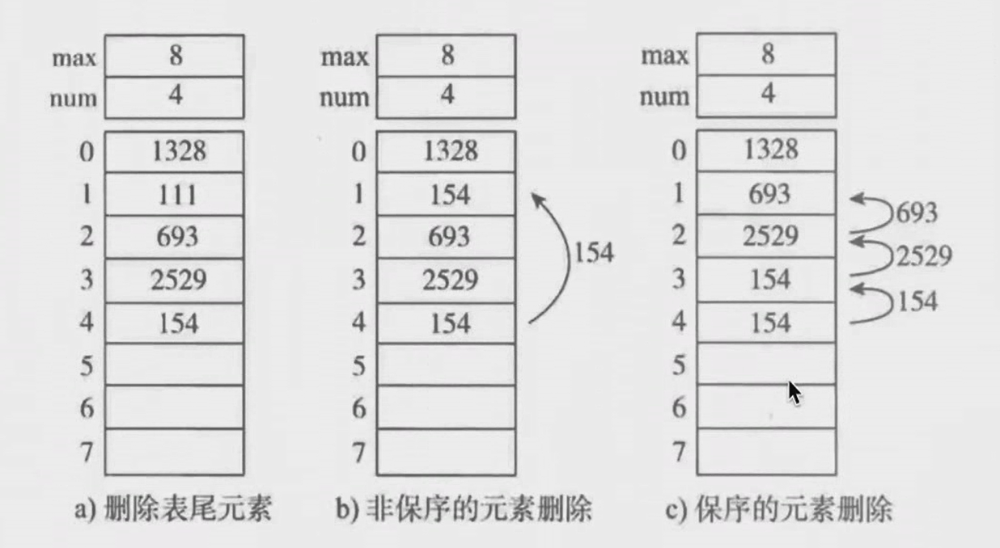

# 顺序表的操作

## 增加元素

如图所示，为顺序表增加新元素111的三种方式。

a.尾端加入元素，时间复杂度为O(1)

b.非保序的加入元素（不常见），时间复杂度为O(1)，打乱了原有数据基本上没有人去用。

c.保序的元素加入，时间复杂度为O(n)

## 删除元素

a.删除表尾元素，时间复杂度为O(1)

b.非保序的元素删除（不常见），时间复杂度为O(1)

c.保序的元素删除，时间复杂度为O(n)