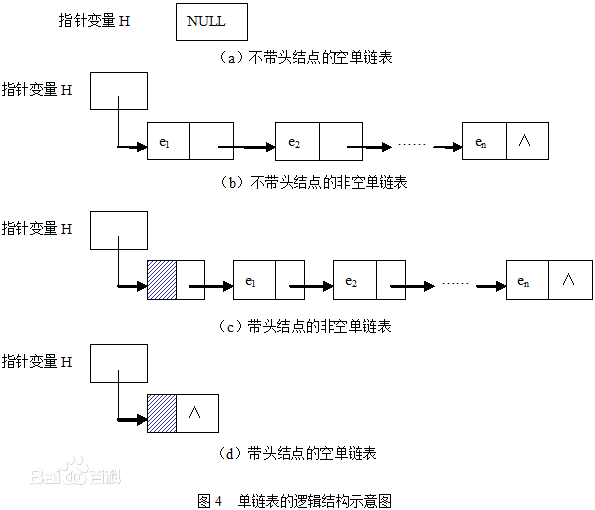

# 链表

## 为什么需要链表

顺序表的构建需要预先知道数据大小来申请连续的存储空间，而在进行扩充时又需要进行数据的搬迁，所以使用起来并不是很灵活。

链表结构可以充分利用计算机内存空间，实现灵活的内存动态管理。

## 链表的定义

链表（Linked list）是一种常见的基础数据结构，是一种线性表，但是不像顺序表一样连续存储数据，而是在每一个节点（数据存储单元）里存放在下一个节点的位置信息（即地址）。

## 链表的基本概念

根据《数据结构》书中介绍，一个线性表是n个数据元素的有限序列，它的长度可根据需要增长或缩短，还有一系列对线性表的操作。

线性表可分为顺序存储结构和链式存储结构两种。

顺序存储结构的特点是逻辑关系上相邻的两个元素在物理位置上也相邻。

链式存储结构的特点是不需要逻辑上相邻的元素在物理位置上也相邻。

下面重点介绍一下链式存储结构的线性链表，线性链表可分为单链表，循环链表，双链表。

线性表特点是用一组任意的存储单元存储线性表的数据元素，同时还存储一个指向后继信息的信息，这两部分信息组成为结点。结点包含两部分数据域和指针域。指针域存储信息成为指针或链。链表中只包含一个指针域，故称为单链表。

## 链表和顺序表的区别

同样存储一组数据顺序表的特点，要求存储空间必须连续，而且一旦不够的情况下需要动态的去改变数据区。

链表可以在进行扩充的时候原有数据不用变，数据可以多一个扩充一个多一个扩充一个。

