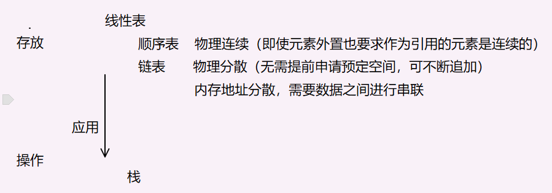
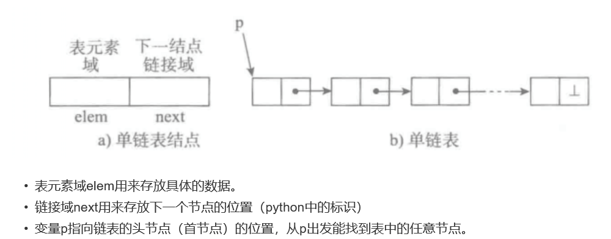
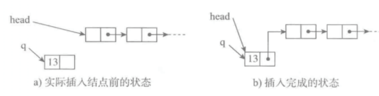
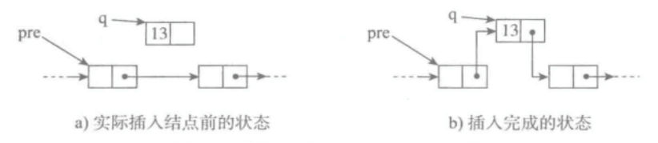
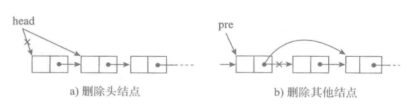

# 引子

数据结构指的是是数据的组织的方式。从单个数据到一维结构（线性表），二维结构（树），三维结构（图），都是组织数据的不同方式。



# 为什么需要链表？　　

顺序表的构建需要预先知道数据大小来申请连续的存储空间，而在进行扩充时又需要进行数据的搬迁，所以使用起来并不是很灵活。

链表结构可以充分利用计算机内存空间，实现灵活的内存动态管理。

链表（Linked list）是一种常见的基础数据结构，是一种线性表，但是不像顺序表一样连续存储数据，而是在每一个节点（数据存储单元）里存放下一个节点的位置信息（即地址）。

# 什么是单链表？

单向链表也叫单链表，是链表中最简单的一种形式，它的每个节点包含两个域，一个信息域（元素域）和一个链接域。这个链接指向链表中的下一个节点，而最后一个节点的链接域则指向一个空值。   



# 单链表应当支持哪些基本操作？

- is_empty() 链表是否为空
- length() 链表长度
- travel() 遍历整个链表
- add(item) 链表头部添加元素
- append(item) 链表尾部添加元素
- insert(pos, item) 指定位置添加元素
- remove(item) 删除节点
- search(item) 查找节点是否存在 

## 操作图解：

### add



### insert



### remove

　

# 代码实现

注意点：

因为没有计数，因此诸多操作都离不开遍历，何时停止不可迷糊。另外，不要忘记经常要考虑的特殊情况。如果为空会如何？如果链表中只有一个节点会如何？构造新链时，该遵循怎样的顺序？（先保证原链不断）

```python
class Node(object):
    def __init__(self, value):
        # 元素域
        self.value = value
        # 链接域
        self.next = None


class LinkedListOneway(object):
    def __init__(self, node=None):
        self.__head = node

    def __len__(self):
        # 游标，用来遍历链表
        cur = self.__head
        # 记录遍历次数
        count = 0
        # 当前节点为None则说明已经遍历完毕
        while cur:
            count += 1
            cur = cur.next
        return count

    def is_empty(self):
        # 头节点不为None则不为空
        return self.__head == None

    def add(self, value):
        """
        头插法
        先让新节点的next指向头节点
        再将头节点替换为新节点
        顺序不可错，要先保证原链表的链不断，否则头节点后面的链会丢失
        """
        node = Node(value)
        node.next = self.__head
        self.__head = node

    def append(self, value):
        """尾插法"""
        node = Node(value)
        cur = self.__head
        if self.is_empty():
            self.__head = node
        else:
            while cur.next:
                cur = cur.next
            cur.next = node

    def insert(self, pos, value):
        # 应对特殊情况
        if pos <= 0:
            self.add(value)
        elif pos > len(self) - 1:
            self.append(value)
        else:
            node = Node(value)
            prior = self.__head
            count = 0
            # 在插入位置的前一个节点停下
            while count < (pos - 1):
                prior = prior.next
                count += 1
            # 先将插入节点与节点后的节点连接，防止链表断掉，先链接后面的，再链接前面的
            node.next = prior.next
            prior.next = node

    def remove(self, value):
        cur = self.__head
        prior = None
        while cur:
            if value == cur.value:
                # 判断此节点是否是头节点
                if cur == self.__head:
                    self.__head = cur.next
                else:
                    prior.next = cur.next
                break
            # 还没找到节点，有继续遍历
            else:
                prior = cur
                cur = cur.next

    def search(self, value):
        cur = self.__head
        while cur:
            if value == cur.value:
                return True
            cur = cur.next
        return False

    def traverse(self):
        cur = self.__head
        while cur:
            print(cur.value)
            cur = cur.next
```

