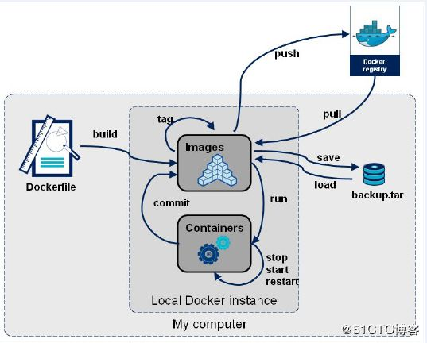
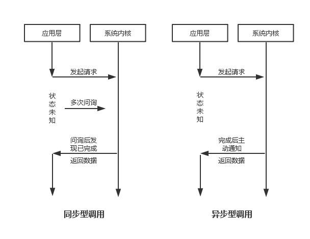
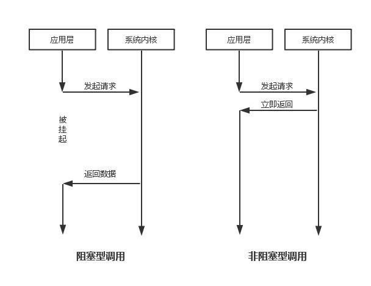
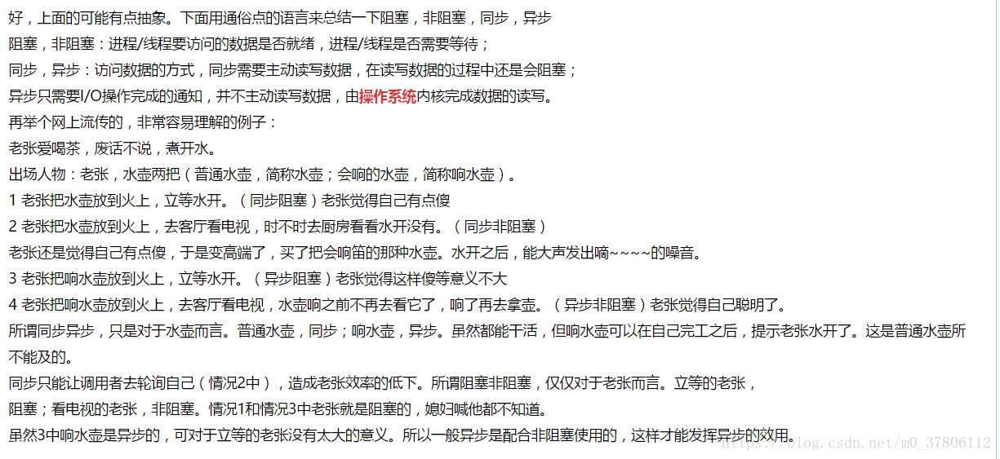

# I.Docker

**先来看这张图，这是docker的五个部分。**

## 一.docker是啥？

## 二.docker核心概念

首先说说镜像，docker的镜像相当于面向对象里面的类，镜像就是一个只读的模板。

# II.微服务架构

# III.Tornado

## 一.框架简介

Tornado是python比较有名的三大框架之一。

- Django大而全；
- Flaks小而精；
- Tornado性能高；

Tornado性能比Django和Flask高很多，是因为Tornado在底层IO处理机制上就和Django以及Flaks有着根本的区别：

- Tornado、gevent、asyncio、aiohttp：底层使用的是时间循环+协程（协程概念会在基础知识里面提到）
- Django和Flask：传统的模型、阻塞IO模型

**Tornado优势：**

1. 异步编码的一套解决方案。
2. tornado不只是一个web框架，也是一个web服务器。
3. tornado是基于协程的解决方案。（这次多次提到协程，一定要把协程好好看看。）

4. tornado提供了websocket的长连接（web聊天，消息推送）

   go 语言和nodejs都是基于协程实现的。

**tornado如何实现高并发：**

1. 异步非阻塞IO。
2. 基于epoll的事件循环。

3. 协程提高了代码的可读性。

## 二.同步、异步、阻塞、非阻塞

### **1.阻塞、非阻塞**

阻塞是指调用函数的时候当线程被挂起。

非阻塞是指调用函数的时候线程不会被挂起，而是立即返回。

### **2.同步、异步**

同步就是你告诉老婆去做饭，返回老婆开始做饭一直等待上桌。

异步是，你告诉老婆让她去做饭，如果老婆同意会立即返回1，你等待老婆做好，你可以做其他事情，做好之后老婆总有通知你的方式，（比如你在玩电脑，你老婆会揪着你的耳朵去吃饭）。如果老婆不做了，她会立刻通知你，返回-1，这时候也不会阻塞，还有一种情况就是你老婆答应你了，结果过了一会大喊一声，老娘不做了，但也会通知你，但是最后吃饭到你需要你自己获取老婆的通知然后去端饭。

> 同步和异步关注的是获取结果的方式，同步是获取到结果之后进行下一步操作，阻塞和非阻塞关注的是接口当前的线程状态，同步可以调用阻塞也可以非阻塞，异步是调用非阻塞的接口。

### 3.总览

1. **同步机制**发送方请求之后，需要等接收方发回响应后才能接。
2. **异步机制**发送方发送一个请求之后不等待接收方响应这个请求，就继续发送下一个请求。
3. **阻塞调用**调用结果返回之前，当前线程会被挂起。调用线程只有在得到结果之后才会返回，线程在此过程中不进行其他操作。
4. **非阻塞调用**调用结果不能马上返回，当前编程也不会被挂起，而是立即返回执行下一个调用。（网络通信中主要指的是网络套接字Socket的阻塞和非阻塞方式，二Socket的实质就是IO操作）

5. **同步阻塞方式**发送方，发送请求之后一直等待响应。接收方处理请求时进行的IO操作如果不能马上等到返回结果，就一直等到返回结果后，才响应发送方，期间不进行其他工作。
6. **同步非阻塞方式**发送方，发送请求之后，一直等待响应，接收方处理请求时进行的IO操作如果不能马上得到结果，就立即返回，去做其他事情。但是由于没有得到请求处理结果，不响应发送方，发送方一直等待，一直到IO操作完成后，接收方获得结果响应发送发后，接收方才进入下一次请求过程。（实际不应用）

7. **异步阻塞方式**发送方，向接收方请求后，不等待响应，可以继续其他工作，接收方处理请求时进行IO操作如果不能马上得到结果，就一直等到返回结果后，才响应发送方，期间不进行其他操作。（实际不应用）

8. **异步非阻塞方式**发送方，向接收方请求后，不等待响应，可以继续其他工作，接收方处理请求时进行IO操作如果不能马上得到结果，也不等待，而是马上返回去做其他事情。当IO操作完成以后，将完成状态和结果通知接收方，接收方在响应发送方。（效率最高）

### 4.故事引导

**概念：**

同步/异步：形容一次方法的调用，在单线程中。描述的是执行者是否具备主动通知功能。

> 同步，调用者会等到方法调用返回后才继续后面的行为。

> 异步，调用者不需要等到方法返回，方法执行完毕后会主动通知调用者。

阻塞/非阻塞：调用者是否可以执行多任务，在多线程中。描述的是调用者的多个线程是否可以同时执行。

> 阻塞，线程1和线程2不能同时执行

> 非阻塞，线程1和线程2可以同时执行

**阻塞、非阻塞、多路IO复用，都是同步IO，异步必定是非阻塞的，所以不存在异步阻塞和异步非阻塞的说法。真正的异步IO需要CPU的深度参与。换句话说，只有用户线程在操作IO的时候根本不去考虑IO的执行全部都交给CPU去完成，而自己只等待一个完成信号的时候，才是真正的异步IO。所以，拉一个子线程去轮询、去死循环，或者使用select、poll、epool，都不是异步。**

## 三.核心模块

ioloop

多线程