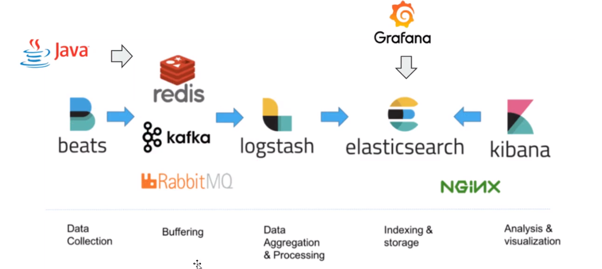

**ES在大厂使用率比较高！！！**

## 主要功能：

- 分布式搜索引擎
- 大数据近实时分析引擎

## 产品特性：

- 高性能，和T + 1 说不
- 容易使用/容易拓展

## 有哪些大厂在使用Elasticseach?

> 小米、饿了么、嘀嘀出行、携程旅游、阿里云、腾讯云

就说用这个也不会掉面。。

EX全球下载量超过了3.5亿次。

## 起源-Lucene

- 基于java语言开发的搜索引擎库类。
- 创建于1999年，2005年成为Apache顶级开源项目。
- Lucene具有高性能、易拓展的有点
- Lucene的局限性：
  - 只能基于java语言开发。
  - 类库的接口学习续签陡峭，东西都需要自己去搞。
  - 原声不支持水平拓展，这些东西都属要手动创建。


## Solr VS Elasticsearch

- **solr和elasticserch都是基于Lucene实现的。**

- solr利用zookeeper进行分布式管理，而elasticsearch自身带有分布式协调管理功能；

- solr比elasticsearch实现更加全面，solr官方提供的工具能够更多，而elasticsearch本身更注重核心功能，高级功能多由第三方插件提供。

- solr在传统的搜索应用中表现好于elastucsearch，而elasticsearch在实时搜索应用方面比solr表现好。

  solr在静态数据库搜索比较好，elasticsearch更动态。

**总结：**

- 当单纯的对已有数据进行搜索时，Solr更快。

- 当实时简历索引时，Solr会产生IO阻塞，查询性能较差，Elasticsearch具有明显的优势。
- 随着数据量的增加，Solr的搜索效率会变得更低，而Elasticsearch却没有明显的变化。

## Elasticsearch的诞生

- 2004年Shay Banon基于Lucene开发了Compass
- 2010年Shay Banon 重写了 Compass，取名Elasticsearch
  - 支持分布式、可水平拓展
  - 降低全文检索的学习曲线，可以被任何编程语言调用

**Shay Banon Elasticsearch创始人**

> Search is something that any application should have.

## 市场反应

- 2010年第一次发布；2012年成立公司
- 成立6个月，160万下载，首轮招募到1000万美金风险投资。
  - Rod Johnson
  - Benchmark Capital / Data Collectve 
- "不要求你必须是一位数据科学家才能把它用好！"

## Elasticsearch版本与升级

- 0.4：2010年2约第一次发布
- 1.0：2014年1月
- 2.0：2015年10月
- 5.0：2016年10月
  - TF-IDF 用于数据挖掘信息解锁的架线技术
    - TF：
    - IDF：密文本频率指数。
  - 倒排索引。
  - TF-IDF 改成了 BM25，性能提升。
  - Type有了改变支持了keyword类型。
- 6.0：2017年10月
  - 基于Lucene7.0开发的。
  - 提升用户体验，为什么ES可以发展这么好一定要注重给用户体验。
  - sql的支持。
- 7.0：2019年4月

EOL Support - http://www.elastic.co/cn/support/eoll

## 新特性7.x

- 基于Lucene8.0开发。
- 重大改进 - 正式废除单个索引下多个Type的支持。
- 7.1开始，Security功能免费使用。
- ECK - Elasticeach Operator on Kubernetes 
- 新功能
  - New Cluster coordination
  - Feature-Complete High Level REST Client 
  - Script Score Query
- 性能优化
  - 默认的Primary Shard 数从5改为1，避免Over Sharding 
  - 性能优化，更快的Top K

## Elastic的发展

- 2015年3月收购Elastic Cloud , 提供Cloud服务。
- 2015年3月收购了PackeBeat
- 2016年9月收购了PreAlert - Machine Learning 异常检测
- 2017年6月收购了 Opbeat 进军 APM
- 2017年11月收购了 Saas 厂商 Swiftype ,提供网站和APP搜索
- 2018年X-pack开源

## Elasticsearch的分布式架构

- 集群规模可以从单个拓展至百个节点
- 高可用 & 水平拓展
  - 服务和数据两个维度
- 支持不同的节点类型
  - 支持 Hot & Warm 架构

## 支持多种方式集成接入

- 多种编程语言的类库（https://www.elastic.co/guide/en/elasticsearch/client/index.html）
  - java / .NET / Python / Ruby / PHP / Groovy / Perl
- RESTful API v.s Transport API
  - 9200 v.s 9300（建议使用RESTful API）
- JDBC & ODBC

## Elasticsearch的主要功能

- 海量数据的分户式存储以及集群管理

  - 服务与数据的高可用，水平扩展

- 近实时搜索，性能卓越

  - 结构化 / 全文 / 地理位置 / 自动完成

- 海量数据的近实分析

  - 聚合功能

  

## Logstash：数据处理管道

- 开源的服务器端数据处理管道，支持从不同来源采集数据，转换数据，并将数据发送到不同的存储库中。
- Logastsh 诞生于2009年，最初用来做日志的采集与处理
- Logstash 创始人 Jordan Sisel
- 2013年被Elasticsearch收购

## Logstash特性

- 实时解析和数据转换
  - 从IP地址破译出地理坐标
  - 将IP数据匿名化，完全排除敏感字段
- 可拓展
  - 200多个插件（日志/数据库/Arcsigh/Netflow）
- 可靠性安全性
  - Logstash会通过持久化队列来保证至少运算中的事件送达依次
  - 数据传输加密
- 监控

## Kibana：可视化分析利器

- Kibana 名字的含义 = Kiwifruit + Banana （奇异果+香蕉）

  没啥特殊含义，就算程序员对软件的命名比较随意

- 数据可视化工具，帮助用户解开对数据的任何疑问

- 基于Logstash的工具，2013年加入Elastic公司

## BEATS- 轻量的数据采集器

**轻量的数据可以用BEATS进行操作。**

https://www.elastic.co/cn/products/beats

## X-Pack：商业化套件

- 6.3之前的版本，X-Pack以插件方式安装
- X-Pack开源后，Elastucsearch & Kibana 支持 OSS 版和 Basic 两种版本
  - 部分X-Pack功能支持免费使用，6.8和7.1开始，Security功能免费。
- OSS，Basic，黄金级，白金级
- https://www.elastic.co/cn/subscriptions

## ELK-应用场景

- **网站搜索** / 垂直搜索 / 代码搜索
- **日志管理与分析** / 安全指标监控 / 应用性能监控 / WEB抓取舆情分析

## 日志的重要性

为什么重要：

- 运维：医生给病人看病。日志就算病人对自己的描述
- 恶意攻击，恶意注册，刷单，恶意代码猜测

挑战：

- 我关注点很多，任何一个点都可能引起问题
- 日志分散在很多机器，出了问题时，才发现日志被删除了
- 很多运维人员是消防，哪里有问题去哪里

## 日志管理

1. 日志搜集
2. 格式化分析
3. 全文检索
4. 风险警告

## Elastucsearch与数据库的集成

- 单独使用Elastucsearch存储

- 以下情况可考虑与数据库集成

  - 与现有系统集成

  - 需考虑事务性

    ES对事务的处理比较薄弱，这些数据需要有事务的特性那就得结合数据库同时使用了。

  - 数据更新频繁

**GO-mysql-Elastucsearch**

应用层做两次操作。

先更新mysql,

在更新ES

可以AOP实现。

**第一种：同步双写**

写mysql的时候同步将数据更新到ES

**第二种：异步双写**

加MQ，做数据更新的时候把数据加入到MQ里面通过，MQ的消费来触发mysql。

**第三种：异步双写**

数据库，表time，crud操作。更新time字段内容。

追加一个定时程序，worker，一定的周期去扫描表，将时间有变化的逐步写入到ES

优点：解决硬编码问题

缺点：实效性比较差，定时器这东西不可能设为秒级。

**第四种：BinLog同步方式（要求程序员的水平比较高）**

读取mysql的同步日志，获取动态的信息，将信息转换未mq，

还要写一个mq的消费程序。

优点：解决硬编码问题，解决实时性问题。

缺点：操作步骤繁琐，对程序员能力要求很高，mq存在网络丢包的风险。

> 以上的几种方案根据实际需求，实际分析。
>
> 第一种方法逻辑比较清晰，维护简单，最牛掰的第四种方法维护稍微有点困难。
>
> 都是双刃剑。

## 指标分析 / 日志分析



1. 通过beats进行日志采集。
2. 为了加快速度我们加入NoSql，使用redis/kafka/RabbitMQ做缓存层，提升速度。
3. 导入logstash做数据整合，数据筛选。
4. 最终导入到elastucsearch里面去。
5. 然后通过kibana or Grafana对日志进行分析。

## Elastucsearch的文件目录结构

| 目录    | 配置文件          | 描述                                                        |
| ------- | ----------------- | ----------------------------------------------------------- |
| bin     |                   | 脚本文件，包括启动Elastucsearch，安装插件。运行统计数据等。 |
| config  | elastucsearch.yml | 集群配置文件，user,role,based相关配置                       |
| JDK     |                   | java运行环境                                                |
| data    | path.data         | 数据文件                                                    |
| lib     |                   | java类库                                                    |
| logs    | path.log          | 日志文件                                                    |
| modules |                   | 包换所有ES模块                                              |
| plugins |                   | 包含所有已安装插件                                          |

**简介：**

ES支持很多插件，我们常用的分词插件都支持。

举个例子：我和你去看电影，用英文的分词插件会把每个字符拆分开，如果用中文插件，就会把这些东西分的更倾向于我们中文的使用习惯。

## JVM配置（java虚拟机）

- 修改JVM - config / jvm.options
  - 7.1下载的默认设置为1GB
- 配置的建议
  - Xmx 和 Xms 设置成一样
  - Xmx不要超过机器内存的50%
  - 不要超过30GB - https://www.elastic.co/blog/a-heap-of-trouble

## Elastucsearch基本概念

- index索引
  - type类型
  - Document文档
- Node节点
  - Shard分片

## 抽象与类比

| RDBMS  | Elastucsearch |
| ------ | ------------- |
| Table  | Index(Type)   |
| Row    | Document      |
| Column | Filed         |
| Schema | Mapping       |
| SQL    | DSL           |

1. 在7.0之前，一个index可以设置多个Types
2. 目前Type已经被Deprecated，7.0开始，一个索引能创建一个Type- "_doc"
3. 传统关系型数据库和Elastucsearch的区别
   1. Elastucsearch-Schemaless / 相关性 / 高性能全文检索
   2. RDMS - 事务性 / Join

## 文档（Document）

- Elastucsearch是面向文档的，文档是所有可搜索数据的最小单位。
  - 日志我呢见中的日志项
  - 一本电影的具体信息 / 一张唱片的详细信息
  - MP3d播放器的一首歌 / 一篇PDF文档中的具体内容。
- 文档会被序列化成JSON格式，保存在Elastucsearch中

  - JSON对象由字段组成
  - 每个字段都有对应的字段类型（字符串 / 数值 / 布尔 / 日期 / 二进制 / 范围类型）
- 每个文档都有一个 Unique ID
  - 你可以自己指定ID
  - 或者通过Elastucsearch自动生成

## JSON文档

- 一篇文档包含一系列的字段。类似数据库表中一条记录
- JSON文档，格式灵活，不需要预先定义格式
  - 字段的类型可以指定或者通过Elastucsearch自动推算
  - 支持数组 / 支持嵌套

## 文档的元数据

**元数据，用于标注文档的相关信息**

- _index - 文档所属的索引名
- _type - 文档所属的类型名，7.0之后只支持`__doc`
- _id - 文档唯一 ID
- _source : 文档的原始Json数据
- _all：整合所有字段内容到该字段，已被废除
- _version：文档的版本信息
- _score：相关性打分

## 索引

- index - 索引是文档的容器，是一类文档的结合
  - Index体现了逻辑空间的概念：每个索引都有自己的Mapping定义，用于定义包含的文档的字段名和字段类型
  - Shard体现了物理空间的概念：索引中的数据分散在Shard上
- 索引的Mapping 与 Settings
  - Mapping 定义文档字段的类型
  - Setting定义不同的数据分布

## 索引的不同语义

- 名词：一个Elastucsearch集群中，可以创建很多个不同的索引。
- 动词：保存一个文档到Elastucsearch的过程也叫做索引（indexing）
  - ES中，创建一个倒排索引的过程。
- 名词：一个B树索引，一个倒排索引。

正拍索引？

一本书的目录可以简单理解为正拍索引。

倒排索引？

一本书的内容或者标题进行分词，搜索分词的内容显示与分词相关的内容。

## Type

- 在7.0之前，一个index可以设置为多个Types
- 6.0开始，Type已经被Deprecated。7.0开始，一个索引只能创建一个Type - ”_doc“

## 一些基本的API

- indices
  - 创建index
    - PUT Movies
  - 查看所有Index
    - _cat/indices

**查看索引**

cerebro可视化插件，可以查看到索引

## 分布式系统的可用性与拓展性

- 高可用性
  - 服务可用性 - 允许有节点停止服务
  - 数据可用性 - 部分节点丢失，不会丢失数据
- 可拓展性
  - 请求量提升 / 数据的不断增长（将数据分不到所有节点上）

## 节点

- 节点是一个Elastucsearch的实例
  - 本质上就算一个JAVA进程。
  - 一台机器上可以运行多个Elastucsearch进程，但是生产环境一般建议一台机器上只运行一个Elastucsearch实例
- 每一个节点都有名字，通过配置文件配置，或者启动的时候 - Elastucsearch = node 1 指定

- 每一个节点在启动之后，会分配一个UID，保存在data目录下

## Master-eligible nodes 和 Master Node

- 每个节点启动后，默认就是一个 Master eligible 节点
  - 可以设置node.master:false禁止
- Master-eligible节点可以参加选主流程，成为Master节点
- 当第一个节点启动的时候，它会将自己选举成Master节点
- 每个节点上都保存了集群的状态，只有Master节点才能修改集群的状态信息
  - 集群状态（Cluster State），维护了一个集群中，必要的信息
    - 所有的节点信息
    - 所有的索引和相关的Mapping 与 Setting信息
    - 分片的路由信息
  - 任意节点都能修改信息会导致数据不一致

## Data Node & Coordinating Node

- Data Node
  - 可以保存数据的节点，叫做Data Node。负责保存分片数据。在数据拓展上起到了至关重要的作用。
- Coordinating Node
  - 负责接受Client的请求，将请求分发到合适的节点，最终把结果汇聚到一起
  - 每个节点默认都起到了Corrdiating Node的职责

## 其他节点类型

- Hot & Warm Node
  - 不同硬件配置的Data Node，用来实现Hot & Warm架构，降低集群部署的成本
- Machine Learning Node
  - 负责跑机器学习的 Job，用来做异常检测
- Tribe Node
  - （5.3 开始使用 Cross Cluster Serarch ）Trile Node 连接到不同的 Elasticsearch集群，并且支持将这些集群当成一个单独的集群处理

## 分片（Primary Shard & Replica Shard）

- 主分片，可以解决数据水平拓展的问题。通过主分片，可以将数据分布到集群内的所有节点之上
  - 一个分片是一个运行的Lucene的实例
  - 主分片数在索引创建时指定，后续不允许修改，除非Reindex
- 副本，可以解决数据高可用的问题。分片是主分片的拷贝
  - 副本分片数，可以动态题调整
  - 增加副本数，还可以在一定程度上提高服务的可用性（读取的吞吐）

- 一个三节点的集群中，blogs索引的分片分布情况
  - 思考：增加一个节点或改大主分片数对系统的影响？

## 分片的设定

- 对于生产环境中分片的设定，需要提前做好容量规划

  - 分片数设置过小

    - 导致后续无法增加节点实现水平拓展

    - 单个分片数据量太大，导致数据重新分配耗时

  - 分配数设置过大，7.0开始，默认主分片设置成1，解决了 over-sharding的问题

    - 影响搜索结果的相关性打分，影响统计结果的准确性。
    - 单个节点上过多的分片，会导致资源浪费，同时也会影响性能。

## 查看集群的健康状况

```
GET _cluster/health
```

```
{
	"cluster_name":
	"status":"green",
	"timed_out": false,
	"number_of_nodes":2,
	"number_of_data_nodes":2,
	"active_shards":70,
	"relocating_shards":0,
	"initializing_shards":0,
	"unassigned_shards":0,
	"delayed_unassigned_shards":0,
	"number_of_pending_tasks":0,
	"number_of_in_flight_fetch":0,
	"task_max_waiting_in_queue_millis":0,
	"active_shards_prcent_as_number":100.0
}
```

**Cerero**

- Green - 主分片与副本都正常分配

- Yellow - 主分片全部正常匹配，有副本分片未能正常分配

- Red - 有主分片未能分配

**例如，当服务器的磁盘容量超过85%时，去创建了一个新的索引**

## 文档的CRUD

| -      | -                                                            |
| ------ | ------------------------------------------------------------ |
| Index  | PUT my_index/_doc/1<br/>{"user":"mike","comment":"You know,for search"} |
| Create | PUT my_index/_create/1<br />{"user":"mike","comment":"You know,for search"}<br />POST my_index/_doc(不指定ID，自动生成)<br />{“user”:"mike","comment":"You know,for search"} |
| Read   | GET my_index/_doc/1                                          |
| Update | POST my_index/_update/1<br />{"doc":{"user":"mike","comment":"You know , Elasticsearch"}} |
| Delete | DELETE my_index/_doc/1                                       |

- Type 名，约定都用`_doc`

- Create - 如果ID已经存在，会失败
- Index - 如果ID不存在，创建新的文档。否则，先删除现有文档，在创建新的文档，版本会增加。
- Update - 文档必须已经存在，更新只会对相应字段增量修改。

