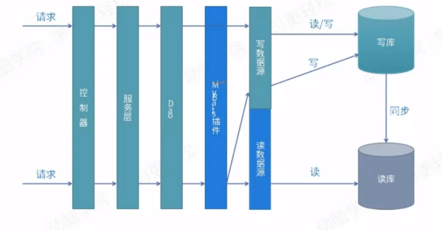

## 解决方案-中间件

优点：

- 源程序不需要做任何改动就可以实现读写分离；
- 动态添加数据源不需要重启程序；

缺点：

- 程序依赖于中间件，会导致切换数据库变得困难；
- 由于中间件做了中转代理，性能有所下降；

## 解决方案-应用层

优点：

- 多数据源切换方便，有程序自动完成；
- 不需要引入中间件；
- 理论上支持任何数据库；

缺点：

- 有程序员完成，运维参与不到。
- 不能做到动态增加数据源；

应用的解决方案有？

- 驱动实现

  com.mysql.jdbc.ReplicationDriver

  Sharding-jdbc

- MyBatis plugin(sqlType：selete，update，inster)

- Spring Aop + Mybatis plugin + 注解

- Spring 动态数据源+ mybatis plugin 

## Docker安装mysql主从

```
--------
docker pull xiaochunping/mysql-master;
docker pull xiaochunping/mysql-slave;

docker run \
--name mysql-master \
--privileged=true \
-v /home/mysql/master-data:/var/lib/mysql \
-p 3306:3306
-e MYSQL_ROOT_PASSWORD=root \
-d xiaochunping/mysql-master

docker run \
--name mysql-slave \
--privileged=true \
-v /home/mysql/slave-data:/var/lib/mysql
-p 3307:3306 --link mysql-master:master \
-e MYSQL_ROOT_PASSWORD=root \
-d xiaochunping/mysql-slave

--------

//如果授权给*就不需要查看ip
docker inspect --format='{{.NetworkSettings.IPAddress}}' mysql-master
docker inspect --format='{{.NetworkSettings.IPAddress}}' mysql-slave

docker exec -it mysql-master /bin/bash
mysql -uroot -proot

grant replication slave on *.* to 'test'@'%' identfied by '123456';
flush privileges;

//查看主的状态
show master staus;

docker exec -it mysql-slave /bin/bash
mysql -uroot -proot
change master to master_host='master', master_user='test', master_password='123456', \
master-port=3306, master_log_file='mysql-bin.000003',master_log_pos=589, master_connect_retry=30;

start slave;
//查看从的状态
show slave status\G


```

## 实现读写分离

如果你的后台结构是 spring + mybatis

可以通过 spring 的 AbstracRoutingDataSource 和 mybatis Plugin拦截器

非常友好的实现读写分离，原有代码不需要任何改变。

